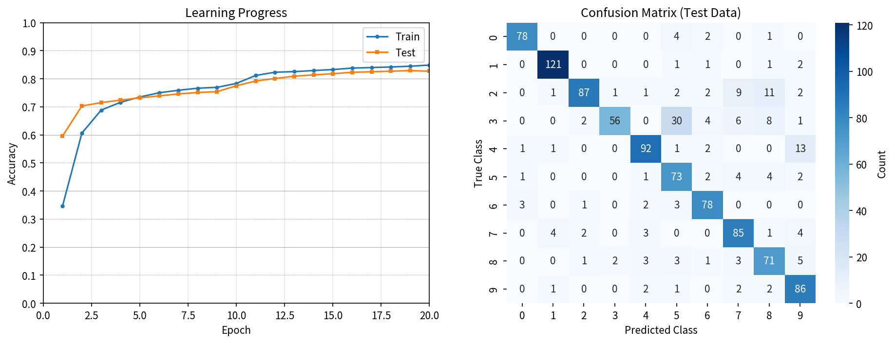
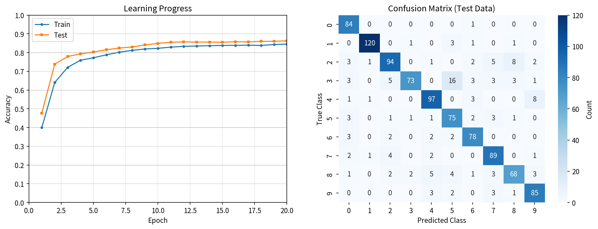
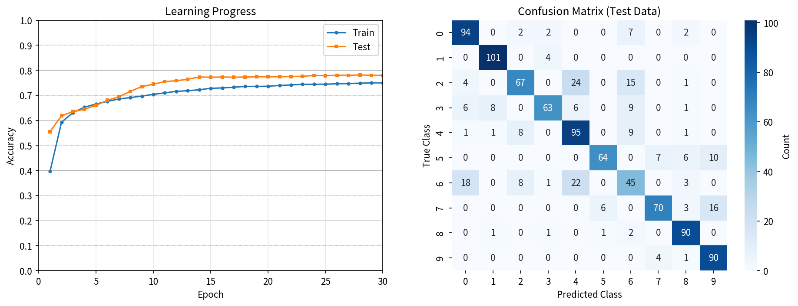

# **コラムED法 - コラム構造を持ったED法**

## Columnar ED: Error Diffusion with Columnar Architecture

[](https://www.python.org/)
[](https://numpy.org/)
[](LICENSE)

## プロジェクト概要

- 金子勇氏提唱の**ED法 (Error Diffusion Learning Algorithm)**に、人間の脳の大脳皮質に見られる**コラム構造（Columnar Architecture）**<span style="font-size: small;">(詳細は後述)</span>を導入することによってED法の拡張を行ったものです。

- 現在公開しているのは、ANN実装版のみになります。

### 主な特徴

1. **オリジナルED法の実装**
   - **微分の連鎖律を用いた誤差逆伝播法**を一切使用せず
   - ED法の飽和項: `abs(z) * (1 - abs(z))` を使用
   - 生物学的に妥当なアミン拡散メカニズム

2. **コラム構造の実装**
   - コラム構造による特徴抽出
   - コラム間の側方抑制による競合
   - 特徴の多様性と汎化性能の向上

## コラム構造とは

### コラム構造

- 大脳皮質の第一次視覚野や連合野で見られる柱状の構造を指す。コラム構造では、似た特性をもったニューロンが近くに配置されている。そのため、似た特性をもったニューロン同士が情報を共有しやすく、効率的に情報処理を行うことができるとされている。[*1]<br>

[*1] 「NeUro+( ニューロプラス )」東北大学の知見✕日立の技術による脳科学ベンチャー<br>
(https://neu-brains.co.jp/neuro-plus/glossary/ka/140/)

### コラムの動作原理(実装上)

本実装では、隠れ層の各ニューロンが特定のクラスに対して選択的に応答するようにコラム構造を組み込んでいます。

1. **コラム帰属度マップ（Column Affinity Map）**
   - 各ニューロンは1つまたは複数のクラスコラムに帰属
   - ハニカム構造（2-3-3-2配置）により10クラスを六角格子状に配置
   - ガウス型帰属度により、コラム中心からの距離に応じて滑らかに影響が減衰

2. **アミン拡散の重み付け**
   - 出力層からのアミン濃度（誤差信号）がコラム帰属度に応じて各ニューロンに拡散
   - 計算式: `amine_hidden = amine_output * diffusion_coef * column_affinity`
   - 各クラスの誤差が、対応するコラムのニューロンに優先的に伝播

3. **コラム構造による特徴分散**
   - 各クラスが異なる空間位置のニューロン群を活性化
   - クラス間の特徴表現が自然に分離される
   - 過度な重複を避けつつ、適度な情報共有を実現

### コラム実装のポイント

1. **ハニカム構造の採用**
   - ハニカム構造は最も効率的な2次元充填構造
   - 各コラムが等距離の隣接コラムを持つため、空間的に均一な配置が可能
   - 生物学的な大脳皮質のコラム配置に近い構造

2. **参加率（Participation Rate）の最適化**
   - `participation_rate=1.0`: 全ニューロンがいずれかのコラムに参加、重複なし
   - 例) 層が512ニューロンで構成されている場合、各クラスには約51ニューロン（512÷10）を均等割り当て(余ったニューロンは先頭クラスから振り当て)
   - 完全分割により各ニューロンの役割が明確化

3. **コラム半径（Column Radius）の調整**
   - `base_column_radius=1.0`: 256ニューロン層での基準値
   - 層のニューロン数に応じて`sqrt(n/256)`でスケーリング
   - 小さすぎると学習が不安定、大きすぎると過学習傾向

4. **側方抑制（Lateral Inhibition）**
   - Winner-Takes-All方式により最も活性化したクラスを選択
   - 誤った予測クラスのコラムを抑制する学習的側方抑制
   - `lateral_weights`を動的に学習し、クラス間競合を強化

5. **ED法との統合**
   - コラム構造は特徴抽出の多様性を提供
   - ED法と同様に、アミン拡散(誤差拡散)に「微分の連鎖律による誤差逆伝播法」を用いず
   - 飽和項`abs(z) * (1 - abs(z))`によりED法の原理を維持

## 学習精度 (2025年12月6日時点)

### MNIST

#### 隠れ層 1層 [512ニューロン]:
  - Test精度 82.70%
  - Train精度: 84.87%
  - コマンド (学習は20エポックまで)
```python
python columnar_ed_ann.py --train 3000 --test 1000 --epochs 20 --seed 42 --hidden 512
```


#### 隠れ層 1層 [1024ニューロン]:
  - Test精度 86.30%
  - Train精度: 84.50%
  - コマンド (学習は20エポックまで)
```python
python columnar_ed_ann.py --train 3000 --test 1000 --epochs 20 --seed 42 --hidden 1024
```


### Fashion-MNIST

#### 隠れ層 1層 [512ニューロン]:
  - Test精度 77.90%
  - Train精度: 74.97%
  - コマンド (学習は30エポックまで)
```python
python columnar_ed_ann.py --train 3000 --test 1000 --epochs 30 --seed 42 --hidden 512 --fashion
```


#### 隠れ層 1層 [1024ニューロン]:
  - Test精度 77.90%
  - Train精度: 74.23%
  - コマンド (学習は30エポックまで)
```python
python columnar_ed_ann.py --train 3000 --test 1000 --epochs 30 --seed 42 --hidden 1024 --fashion
```


## クイックスタート

### インストール

```bash
# リポジトリのクローン
git clone https://github.com/yourusername/columnar-ed-ann.git
cd columnar-ed-ann

# 依存パッケージのインストール
pip install -r requirements.txt
```

### 基本的な実行

```bash
# 単層構造を最適パラメータで実行（MNIST）
python columnar_ed_ann_v026_multiclass_multilayer.py

# 単層構造を最適パラメータで実行（Fashion-MNIST）
python columnar_ed_ann_v026_multiclass_multilayer.py --fashion
```

## パラメータのデフォルト値の設定

グリッドサーチにより得られた隠れ層1層の場合の最適パラメータをデフォルト値として設定済み

### 実行関連のパラメータ

| パラメータ | 値 | 備考 |
|-----------|-----|------|
| `--train` | 3000 | 訓練サンプル数 |
| `--test` | 1000 | テストサンプル数 |
| `--epochs` | 100 | エポック数 |
| `--seed` | 42 | 乱数シード（再現性確保用） |
| `--fashion` | - | Fashion-MNISTを使用（フラグ） |
| `--use_hyperparams` | - | HyperParamsテーブルから設定を自動取得（フラグ） |
| `--list_hyperparams` | - | 利用可能なHyperParams設定一覧を表示（フラグ） |

### ED法関連のパラメータ

| パラメータ | 値 | 備考 |
|-----------|-----|------|
| `--hidden` | 512 | 隠れ層ニューロン数（1層で83.80%達成） |
| `--lr` | 0.20 | 学習率（Phase 1 Extended Overall Best） |
| `--u1` | 0.5 | アミン拡散係数（Phase 1 Extended Overall Best） |
| `--u2` | 0.8 | アミン拡散係数（隠れ層間） |
| `--lateral_lr` | 0.08 | 側方抑制の学習率（Phase 1 Extended Overall Best） |
| `--gradient_clip` | 0.05 | gradient clipping値 |

### コラム関連のパラメータ

| パラメータ | 値 | 備考 |
|-----------|-----|------|
| `--base_column_radius` | 1.0 | 基準コラム半径（Phase 2完全評価Best、256ニューロン層での値） |
| `--column_radius` | None | コラム影響半径（Noneなら層ごとに自動計算） |
| `--participation_rate` | 1.0 | コラム参加率（Phase 2で確定、1.0=全参加・重複なし、優先度：最高） |
| `--column_neurons` | - | 各クラスの明示的ニューロン数（重複許容、優先度：中） |
| `--use_circular` | - | 旧円環構造を使用（デフォルトはハニカム、フラグ） |
| `--overlap` | 0.0 | コラム間の重複度（0.0-1.0、円環構造でのみ有効） |
| `--diagnose_column` | - | コラム構造の詳細診断を実行（フラグ） |

### 可視化関連のパラメータ

| パラメータ | 値 | 備考 |
|-----------|-----|------|
| `--viz` | - | 学習曲線のリアルタイム可視化を有効化（フラグ） |
| `--heatmap` | - | 活性化ヒートマップの表示を有効化（--vizと併用、フラグ） |
| `--save_viz` | - | 可視化結果を保存（パス指定可能） |

## ED法への準拠

金子勇氏のCコードをオリジナルED法のリファレンスとし、オリジナルED法に反しない実装であることを確認済み

| 項目 | 実装 | 判定 |
|------|------|------|
| 出力層飽和項 | `np.abs(z_output) * (1.0 - np.abs(z_output))` | OK |
| 隠れ層飽和項 | `abs(z_neuron) * (1.0 - abs(z_neuron))` | OK |
| アミン拡散 | `amine_hidden = amine_output * diffusion_coef * column_affinity` | OK |
| 重み更新 | アミン濃度ベース、「微分の連鎖律」不使用 | OK |
| Dale's Principle | 興奮性・抑制性ニューロンペア | OK |
| SoftMax |出力の確率化のみに使用(順伝播)| OK |
| アミン拡散 |確率誤差（target_prob - softmax_prob）から計算| OK |

## ディレクトリ構造

```bash
/
├── columnar_ed_ann.py   # メイン実装（最終版）
├── README.md            # 本ファイル
├── docs/                # 関連ドキュメント
└── modules/             # 共通モジュール
```

## ドキュメント

- [docs/ja/ED法_解説資料.md](docs/ja/ED法_解説資料.md) - オリジナルED法 解説資料

## 参考情報

- Kaneko, I. (1999). Error Diffusion Learning Algorithm. (オリジナルC実装)

## ライセンス

LICENSEファイルを参照

## 著者

yoiwa0714

## 謝辞

本実装は、金子勇氏のオリジナルED法実装を参考にしています。

---

**注意**: 本実装は研究・教育目的です。商用利用する場合は、適切なライセンスを確認してください。
