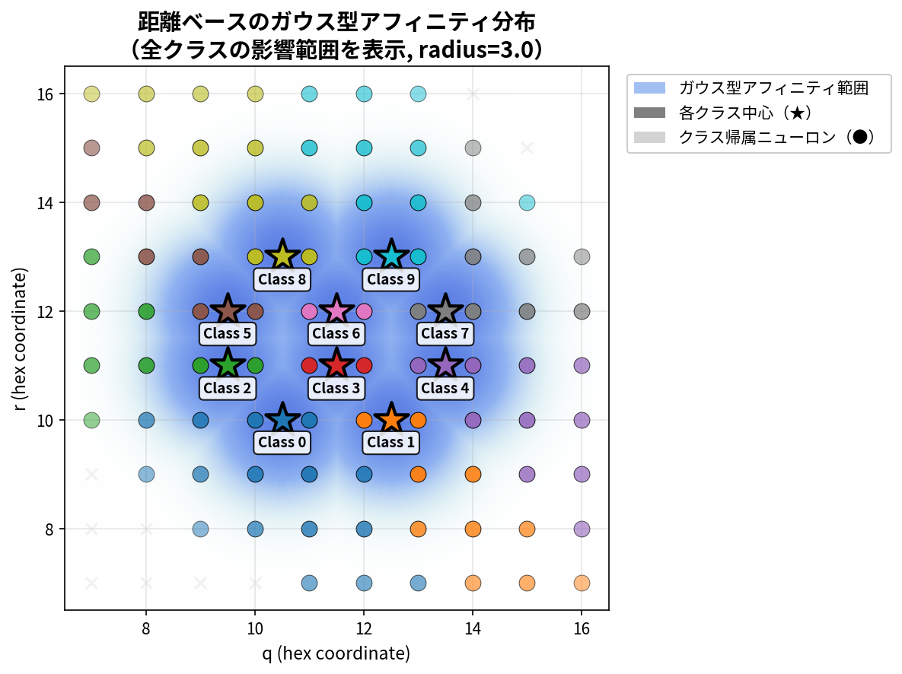
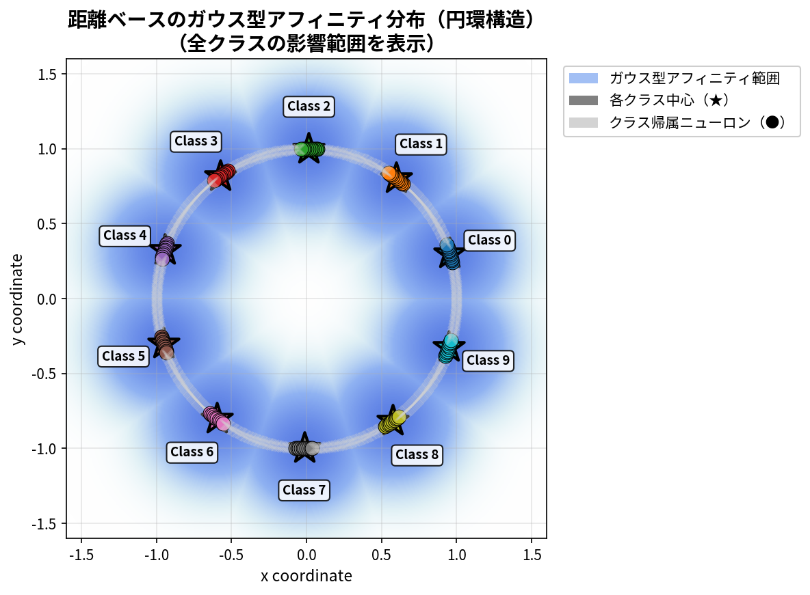

# **【 コラムED法 】 - コラム構造を持つED法**

[](https://www.python.org/)
[](https://numpy.org/)

## 最新の更新（2025-12-28）

### ミニバッチ学習の実装（v030復元）

**v031の試みと失敗**:
- 仮説: 勾配平均化により実効学習率が1/batch_sizeに低下
- 修正: 勾配を合計して使用（平均化を削除）
- 結果: **Test精度9.03%（壊滅的な失敗）**
- 原因: 実効学習率が64倍（6.4）に増加、重みが発散

**理論的再検討の結果**:
- **v030の勾配平均化は実は正しかった**
- 標準的なミニバッチ学習もED法も、勾配平均化で同じ実効学習率になる
- 理論的証明:
  ```
  標準: grad = Σ(∂L/∂W)/N, W += lr×grad → 実効lr = lr
  ED法: grad = Σ(lr×∂L/∂W)/N, W += grad → 実効lr = lr（同じ）
  ```

**v030に復元**:
- 勾配平均化コードを復元
- v030の低精度（67.87%）は勾配平均化のせいではない
- 真の原因を調査中（シャッフル、batch_size、初期化など）

詳細は [MINIBATCH_LEARNING_FIX.md](MINIBATCH_LEARNING_FIX.md) を参照。

---

## プロジェクト概要

- 金子勇氏提唱の**ED法**(以下、オリジナルED法)に、人間の脳の大脳皮質に見られる**コラム構造（Columnar Architecture）**(詳細は後述)を導入することによってオリジナルED法の拡張を行ったものです。
- 「微分の連鎖律を用いた誤差逆伝播法」を使用していません。
- 1つの重み空間で多クラス分類に対応しています。
- 現在公開しているのは、ANN実装版のみになります。
- ペアプログラミングを用いて作成しています。

### 本プロジェクトの特徴

1. **オリジナルED法の忠実な実装**
   - **微分の連鎖律を用いた誤差逆伝播法**は人間の脳の仕組み上あり得ない動作であるという金子勇氏の考えに基づき、**微分の連鎖律を用いた誤差逆伝播法**を一切使用せず
   - オリジナルED法の飽和項: `abs(z) * (1 - abs(z))` を使用
   - 生物学的に妥当なアミン拡散メカニズムを忠実に再現

## コラム構造

### コラム構造とは

- 大脳皮質の第一次視覚野や連合野で見られる柱状の構造を指す。コラム構造では、似た特性を持ったニューロンが近くに配置されている。そのため、似た特性をもったニューロン同士が情報を共有しやすく、効率的に情報処理を行うことができるとされている。[*1]<br>

&nbsp;&nbsp;&nbsp;&nbsp;&nbsp;&nbsp;[*1] 「NeUro+( ニューロプラス )」東北大学の知見✕日立の技術による脳科学ベンチャー<br>
&nbsp;&nbsp;&nbsp;&nbsp;&nbsp;&nbsp;(https://neu-brains.co.jp/neuro-plus/glossary/ka/140/)

### コラム構造導入の背景

- オリジナルED法は、基本的に二クラス分類には強いが、多クラス分類は苦手とする方式だと考えています。(これは私の主観です)
- 金子勇氏のオリジナルのCソースコードには出力クラス毎に重み空間を保持する実装サンプルもありました。そこで、この方式を実装してみたのですが、以下のような問題があることが判明したため、この方式は断念しました。(以下は問題の一部です。)
  - 各出力クラスのネットワークがバラバラ(勝手)に学習した結果の取りまとめ方法が難しい。
  - 学習効率が悪い(学習に時間がかかる)。例えば、10クラス分類で10,000データを学習させた時点で、それぞれのクラスが学習できたデータ数は10,000/10 = 1000データにしかならない。この状況は分類するクラス数が増えるごとに顕著になる。
- オリジナルED法が多クラス分類を苦手とする理由を考えた時、個々のニューロンが出力クラスと結び付いていないため、出力クラス全体の誤差に対する自ニューロンの学習方向が分からないということであると理解しました。
- そこで、出力クラスと個々のニューロンを紐付ける方法を色々と模索している中で、人間の脳の大脳皮質の視覚野などには前項「コラム構造」に記載したような特徴のあるコラム構造があることを知り、これをオリジナルED法を多クラス分類に拡張するためにうまく取り込めないかと思い試行錯誤してみた、ということが背景になります。

### 現在実装されているパラメータに関する補足

- コラムED法の実装はこれが初であるため、特にコラム構造に関連するパラメータに関しては知見が全くない状況です。
- そのため、パラメータの有効/無効性を判断するためにも現時点ではできるだけ多くのパラメータを実装しています。したがって、現時点では実験的な位置付けの実装となっています。
- 現在実装しているパラメータであっても必要が無いと判断されて先々削除されたり、逆に新たな機能が必要となって新たなパラメータが実装される可能性もあります。
- つまり、現在のパラメータが最善ではない可能性があり、新たなパラメータの導入で大きく変化する可能性も秘めていると考えています。

### コラムの動作の概要

本実装では、以下の機能を用いて隠れ層の各ニューロンが特定のクラスに対して選択的に応答するようにコラム構造を組み込んでいます。

1. **コラム帰属度マップ（Column Affinity Map）**
   - **機能詳細**: 各ニューロンがどのクラスに対してどの程度の強さで応答すべきかを定義する重み付けマップ。これにより、特定のクラスに関連する誤差信号が適切なニューロン群に優先的に伝播される
   - 各ニューロンは基本的に1つのクラスコラムに帰属
   - ハニカム構造（2-3-3-2配置）の場合は、10クラスを六角格子状に配置
   - 円環構造の場合は、10クラスを円環状に配置
   - ガウス型帰属度により、コラム中心からの距離に応じて滑らかに影響が減衰
   - **実装**: `create_hexagonal_column_affinity()` 関数

2. **アミン拡散の重み付け**
   - 出力層からのアミン濃度（誤差情報）がコラム帰属度に応じて各ニューロンに拡散
   - 各クラスの誤差は、そのクラスに対応するコラムのニューロンに優先的に伝播
   - 計算式: `amine_hidden = amine_output * diffusion_coef * column_affinity`
   - **実装**: `RefinedDistributionEDNetwork.train_epoch()` メソッド内

### コラム構造の空間配置

コラムED法では、「各ニューロンがどのクラスに応答するか」を定義するために、ニューロンとクラスを空間的に配置します。この配置により、誤差信号（アミン濃度）が適切なニューロン群に優先的に伝播され、効率的な学習が実現されます。

本実装では、2種類のコラム構造（ハニカム構造と円環構造）を提供しています。それぞれ異なる空間トポロジー（ニューロンの配置構造）を持ち、ニューロンとクラスの配置方法が異なります。以下では、512ニューロンで構成される層での具体例を説明します。

#### ハニカム構造（2次元六角格子配置）


*図: ハニカム構造におけるニューロン（ドット）とクラス中心（★0-9）の配置。色の濃淡はガウス型帰属度を表し、各クラス中心に近いほど強い影響を受ける。*

**注**: 作図の都合上、アフィニティ分布の範囲（青色のグラデーション部分）は円形に見えていませんが、実際には各クラス中心（★）から**円形状**にガウス分布しています。

##### 特徴

- 23×23の六角格子上にニューロンを配置
- コラムに参加するニューロン数は参加率 participation_rate(pr)に基づいて決定(以下で詳細を説明)
- 10クラス分類の場合、10個のコラムを2-3-3-2パターンでグリッド中心に配置
- 2次元空間により、コラム間の空間的分離が明確
- 六角距離に基づく等方的な分布のため、クラス中心から等距離にあるニューロンは同じ帰属度を持つ
- ガウス型減衰により、コラム中心から距離に応じて影響力が滑らかに減少（→「3. 距離ベースのガウス型アフィニティ分布」参照）

###### participation_rate(pr)の考え方

- 512ニューロンで構成される層で、participation_rate(pr)を0.1(10%)と指定した場合:
  - 全体の10% (約51ニューロン) がコラムに参加
  - 10クラス分類では、各クラスが5-6個のニューロンを持つ

##### 「六角距離に基づく等方的な分布」とは

- 六角距離とは、六角格子（ハニカム構造）上での2点間の距離を測る方法です。通常のユークリッド距離（直線距離）とは異なり、六角形のマス目に沿って移動する際の最短経路の長さを表します。
- 六角距離を使う理由:
  - ユークリッド距離では六角格子上で方向により不均等になる
  - 六角距離なら全方向で公平な影響範囲を保証
- 等方的な分布の意味:
  - クラス中心から同じ六角距離にあるニューロンは、方向に関係なく同じ帰属度を持つ
  - これにより円形のガウス分布を実現
- 距離の計算例: クラス中心が(11.5, 11.5)、ニューロンAが(11.5, 12.5)、ニューロンBが(12.5, 11.5)の場合
  - 両方とも六角距離=1
  - 両方とも同じaffinity値を持つ（ガウス分布: exp(-0.5 * (1/0.4)^2)）

#### 円環構造（1次元円形配置）


*図: 円環構造におけるニューロン（円周上のドット）とクラス中心（★0-9）の配置。1次元円環上に等間隔で配置され、トーラス距離により端と始点が自然に接続。*

**注**: 円環構造は1次元円周上の配置のため、各クラス中心から円周に沿って左右方向にガウス分布が広がります。トーラストポロジーにより、円環の端（インデックス511）と始点（インデックス0）間も連続的に分布します。

**特徴:**
- 512ニューロンを円周上に配置（1次元トーラストポロジー）
- 10クラスを等間隔＋中心化オフセットで配置
- 各クラスが**5-6個のニューロン**にアクセス（**最適参加率 pr=0.1**）
- 1次元円環配置でもハニカム構造と同じpr=0.1が最適（スパース表現の普遍性）
- トーラス距離により、円環の端と始点が自然に接続

※ **トーラストポロジー**: ドーナツ型の幾何学的構造。1次元円環では、配列の端（インデックス511）と始点（インデックス0）が隣接する。

**構造比較:**

※ **トポロジー**: ニューロンの空間的な配置構造。ハニカムは平面的な2次元配置、円環は円周上の1次元配置を意味します。  
※ **column_radius**: コラム半径。256ニューロン層での最適値を基準とし、層のサイズに応じて自動スケーリング。

| 項目 | ハニカム構造 | 円環構造 |
|-----|------------|---------|
| トポロジー | 2次元六角格子 | 1次元円環（トーラス） |
| 最適pr | **0.1 (10%)** | **0.1 (10%)** |
| 最適bcr | **0.4** | **0.4** |
| ニューロン/クラス | **5-6個** | **5-6個** |
| Test精度 | **84.50%** | **84.40%** |
| Train-Test gap | 3.10% | **2.43%** |
| 空間分離性 | 高（2D） | 中（1D） |
| 計算コスト | 低（スパース） | 低（スパース） |
| 学習速度 | 約19-20秒/エポック | 約19-20秒/エポック |

### コラム実装のポイント

#### ハニカム構造の場合

##### 1. クラス座標の中心化配置

**実装の目的:**  
全10クラスがグリッド中心に配置されることで、各クラスが均等にニューロンへアクセスできる環境を実現

###### クラス座標の中心化配置のイメージ図


**この実装を行う理由:**  
- 当初の実装では、クラス座標を(0,0)～(2,3)のグリッドエッジに配置していた
- 結果、Class 0は距離≤3で12個のニューロンしかアクセスできず、Class 9は37個アクセス可能という不均等が発生
- 中心化により全クラスが43-44個のニューロンに均等アクセス可能となり、学習の公平性が向上
- 生物学的にも、大脳皮質のコラム構造はエッジではなく中心的領域に配置されている

**コードサンプル:**
```python
# 10クラスをグリッド中心に配置
grid_size = int(np.ceil(np.sqrt(n_hidden)))  # 例: 512ニューロン → 23×23グリッド
grid_center = grid_size / 2.0  # 11.5

# 中心化した2-3-3-2配置
class_coords = {
    0: (grid_center - 1, grid_center - 1),   1: (grid_center + 1, grid_center - 1),  # 行1: 2個
    2: (grid_center - 2, grid_center),       3: (grid_center, grid_center),           # 行2: 3個
    4: (grid_center + 2, grid_center),
    5: (grid_center - 2, grid_center + 1),   6: (grid_center, grid_center + 1),       # 行3: 3個
    7: (grid_center + 2, grid_center + 1),
    8: (grid_center - 1, grid_center + 2),   9: (grid_center + 1, grid_center + 2)    # 行4: 2個
}
```

**実装場所:** `modules/column_structure.py` - `create_hexagonal_column_affinity()` 関数

---

##### 2. participation_rate（コラム参加率）の意義

**実装の目的:**  
ニューロンの一部のみがコラムに参加することで、スパース表現を実現し、学習の柔軟性と安定性を両立

**この実装を行う理由:**  
- 過去の実装分析により、意図せず364/512ニューロン（71%）のみが学習に参加していたことが判明
- participation_rate=1.0（全ニューロン参加）では学習が不安定になり、精度がランダム出力レベルに低下
- **最新の探索結果（2025-12-14）**: **participation_rate=0.1（10%）が最適**
  - 各クラス約5ニューロンの高度にスパースな表現で **Test精度84.50%** を達成
  - 従来の71%参加（78.10%）から+6.40ポイントの大幅改善
- スパース符号化により冗長性が排除され、本質的特徴に集中
- 生物学的にも、すべての皮質ニューロンが常に活動するわけではなく、一部は休止状態
- **重要:** 0.0（コラム無意味）と1.0（学習失敗）は禁止値として明示的にエラー化

**パラメータ探索の結果:**
```
participation_rate と Test精度の関係（column_radius=0.4固定）:
  0.05: 78.9%  ← 表現力不足（約2.6個/クラス）
  0.1:  84.5%  ← ★最適値（約5.1個/クラス、スパース表現の最良バランス）
  0.3:  83.5%  ← 冗長性増加開始
  0.5-0.9: 83.0%  ← プラトー（リターン逓減）
```

**コードサンプル:**
```python
# participation_rate検証
if participation_rate is not None:
    if participation_rate <= 0.0 or participation_rate >= 1.0:
        raise ValueError(
            f"participation_rate must be in range (0.0, 1.0), exclusive. "
            f"Got {participation_rate}. "
            f"0.0 makes columns meaningless, 1.0 causes learning instability."
        )

# 最適設定（2025-12-14確定）
affinity = create_hexagonal_column_affinity(512, 10, participation_rate=0.1)
# → 51/512ニューロン（10%）がコラムに参加
# → 各クラスに5-6個のニューロンが均等割り当て（高度にスパース）
```

**実装場所:** `modules/column_structure.py` - `create_hexagonal_column_affinity()` 関数

---

##### 3. 距離ベースのガウス型アフィニティ分布

**実装の目的:**  
コラム中心からの距離に応じて滑らかに影響力が減衰するアフィニティマップを生成

###### ガウス型アフィニティ分布のイメージ図



**注**: 作図の都合上、アフィニティ分布の範囲（青色のグラデーション部分）は円形に見えていませんが、実際には各クラス中心（★）から**円形状**にガウス分布しています。六角距離に基づく等方的な分布のため、距離が等しい位置は同じ帰属度を持ちます。



**注**: 円環構造は1次元円周上の配置のため、各クラス中心から円周に沿って左右方向にガウス分布が広がります。(図では円環の内外にも広がって見えていますが、実際には円周に沿った左右方向のみとなります。) また、トーラストポロジーにより、円環の端（インデックス511）と始点（インデックス0）間も連続的に分布します。

**この実装を行う理由:**  
- 生物学的なコラム構造では、中心ほど強く、周辺ほど弱い活性化が見られる
- ステップ関数的な閾値ではなく、ガウス分布により自然な遷移領域を実現
- 六角距離（hex_distance）により、ハニカム構造に適した等方的な距離計算
- column_radius（σ）により影響範囲を制御可能

**コードサンプル:**
```python
def hex_distance(q1, r1, q2, r2):
    """六角格子上の距離計算（Cube座標系）"""
    return (abs(q1 - q2) + abs(q1 + r1 - q2 - r2) + abs(r1 - r2)) / 2

# アフィニティ計算
for class_idx, (cx, cy) in class_coords.items():
    for neuron_idx, (nx, ny) in enumerate(neuron_coords):
        # 六角距離計算
        dist = hex_distance(nx, ny, cx, cy)
        
        # ガウス型減衰（σ = column_radius）
        affinity[class_idx, neuron_idx] = np.exp(-0.5 * (dist / column_radius) ** 2)
        # 例: dist=0 → affinity=1.0
        #     dist=σ → affinity=0.606
        #     dist=2σ → affinity=0.135
        #     dist=3σ → affinity=0.011
```

**実装場所:** `modules/column_structure.py` - `hex_distance()` 関数、`create_hexagonal_column_affinity()` 関数

---

##### 4. 極小アフィニティ値の自然フィルタリング

**実装の目的:**  
極端に低いaffinity値（10⁻¹¹オーダー）をそのまま保持し、後段の閾値判定（1e-8）で自動除外させることで部分参加を実現

**この実装を行う理由:**  
- 当初、最小affinity=1e-7を強制保証する実装を試みたが、512/512ニューロン全参加となり学習が失敗
- 過去の実装を分析した結果、極小affinity値（~10⁻¹¹）を意図的に残していたことが判明
- `amine_hidden_3d >= 1e-8`の閾値判定により、極小affinity値は自動的にマスクアウト
- この自然なフィルタリングが364/512ニューロンの部分参加を実現し、学習成功につながった
- 人為的な最小値保証は、この生物学的に妥当なメカニズムを破壊する

**コードサンプル:**
```python
# 元のマスク方式
# 極小アフィニティ値は自然に閾値判定で除外される（意図的な部分参加）
mask = np.zeros(n_hidden)
mask[selected] = 1
affinity[class_idx] *= mask  # ← 極小値も保持（人為的な1e-7強制なし）

# 後段の学習ループで自動フィルタリング（ed_network.py内）
neuron_mask = np.any(amine_hidden_3d >= 1e-8, axis=(1, 2))
# → affinity < 1e-8のニューロンは学習から除外
# → 結果として約70%のニューロンのみが参加
```

**実装場所:** `modules/column_structure.py` - `create_hexagonal_column_affinity()` 関数、`modules/ed_network.py` - `RefinedDistributionEDNetwork` クラス

---

##### 5. 余りニューロンの適切な分配

**実装の目的:**  
ニューロン数÷クラス数で割り切れない場合の余りを、先頭クラスから順に+1個ずつ分配

**この実装を行う理由:**  
- 512÷10=51余り2の場合、単純実装では510個しか使われず2個が未使用
- 過去の実装では余り処理がなく、一部のクラスが不利な状態だった
- 余りを先頭クラスに分配することで、全ニューロンを有効活用
- 実際にはparticipation_rate<1.0のため全体の70%程度が使用される

**コードサンプル:**
```python
if participation_rate is not None:
    # 参加するニューロン数を計算
    target_neurons = int(n_hidden * participation_rate)  # 512 * 0.71 = 363
    neurons_per_class = target_neurons // n_classes       # 363 // 10 = 36
    remainder = target_neurons % n_classes                # 363 % 10 = 3
    
    for class_idx in range(n_classes):
        # 余りニューロンを最初のremainder個のクラスに+1個ずつ分配
        n_neurons_for_this_class = neurons_per_class + (1 if class_idx < remainder else 0)
        # Class 0,1,2: 37個、Class 3-9: 36個
        
        selected = sorted_indices[:n_neurons_for_this_class]
        # ...
```

**実装場所:** `modules/column_structure.py` - `create_hexagonal_column_affinity()` 関数

---

##### 6. 3つのコラム生成モードの優先順位

**実装の目的:**  
複数指定時のコラム生成モードを優先順位付け

**この実装を行う理由:**  
- **モード1（最優先）: participation_rate指定** - 参加率指定、推奨方式
- **モード2（中優先）: column_neurons指定** - 明示的なニューロン数指定、実験的用途
- **モード3（最低優先）: column_radius指定** - 従来方式、互換性維持

- 複数指定時は優先順位に従って選択し、混乱を防ぐ
- この優先順位はこれまでの試行結果により決めたものです
- 3つの内の1つのみを指定した場合、この優先順位は関係ありません

**コードサンプル:**
```python
def create_hexagonal_column_affinity(n_hidden, n_classes=10, 
                                      column_radius=3.0, 
                                      column_neurons=None, 
                                      participation_rate=None):
    """
    使用例:
        # モード1: 参加率指定（推奨）
        affinity = create_hexagonal_column_affinity(512, 10, participation_rate=0.71)
        # → 71%のニューロンがコラムに参加、残り29%は非コラム
        
        # モード2: 明示的なニューロン数指定
        affinity = create_hexagonal_column_affinity(512, 10, column_neurons=51)
        # → 各クラス51個、重複なし
        
        # モード3: 従来のradius方式（互換性維持）
        affinity = create_hexagonal_column_affinity(512, 10, column_radius=3.0)
        # → ガウス分布ベース、重複あり
    """
    if participation_rate is not None:
        # モード1実行
    elif column_neurons is not None:
        # モード2実行
    else:
        # モード3実行（デフォルト）
```

**実装場所:** `modules/column_structure.py` - `create_hexagonal_column_affinity()` 関数

---

## 学習精度(試行結果)

### コラム構造の場合

#### MNIST

##### 隠れ層 1層 [512ニューロン] - v027（最適パラメータ確定版）:
  - Test精度: **84.50%**
  - Train精度: **87.60%**
  - 検証日: 2025-12-14
  - 最適パラメータ: **column_radius=0.4**, **participation_rate=0.1**
  - コマンド
```python
python columnar_ed_ann.py --train 3000 --test 1000 --epochs 30 --hidden 512 --lr 0.20 --u1 0.5 --lateral_lr 0.08 --column_radius 0.4 --participation_rate 0.1 --seed 42
```

**注記**: 上記の結果は、2025-12-14に実施したパラメータ探索により確定した最適値での検証結果です。
- **column_radius=0.4**: コラム半径探索（0.4-1.4）の結果、0.4が最適（Test精度: 0.4=83.0%, 0.6=82.0%, 1.0=79.4%）
- **participation_rate=0.1**: 参加率探索（0.05-0.9）の結果、0.1が最適（Test精度: 0.05=78.9%, 0.1=84.5%, 0.3=83.5%, 0.5-0.9=83.0%）
- **スパース表現**: 各クラス約5ニューロン（51個中5-6個/クラス、10%参加）の高度にスパースな表現により、冗長性を排除し本質的特徴に集中
- **中心化ハニカムコラム構造**（2-3-3-2配置）を採用し、全クラスに均等なニューロンアクセスを実現
- **精度向上**: 従来の78.10%（pr=0.71, bcr=1.0, 2025-12-13）から+6.40ポイントの大幅改善を達成

##### その他の構成:
現在、他のニューロン数構成やFashion-MNISTでの検証結果は取得中です。今後のバージョンアップで順次追加予定です。

---

### 円環構造の場合

#### MNIST

##### 隠れ層 1層 [512ニューロン] - v027（円環構造 + 最適パラメータ確定版）:
  - Test精度: **84.40%**
  - Train精度: **86.83%**
  - Train-Test gap: **2.43%**
  - 検証日: 2025-12-14
  - 最適パラメータ: **column_radius=0.4**, **participation_rate=0.1** (ハニカム構造と同一)
  - その他パラメータ: lr=0.2, lateral_lr=0.08, u1=0.5
  - コマンド
```python
python columnar_ed_ann.py --use_circular --train 3000 --test 1000 --epochs 30 --hidden 512 --lr 0.20 --u1 0.5 --lateral_lr 0.08 --column_radius 0.4 --participation_rate 0.1 --seed 42
```

**注記**: 円環構造においても**participation_rate=0.1**と**column_radius=0.4**が最適であることが確認されました。これにより、スパース表現の原理が**コラム構造の種類（ハニカム/円環）に依存しない普遍的な最適値**であることが実証されました。

**ハニカム構造との性能比較**:
- Test精度差: わずか0.10ポイント（ハニカム84.50% vs 円環84.40%）
- 円環構造の方が汎化性能が若干優れる（gap: 円環2.43% vs ハニカム3.10%）
- 学習速度: 同等（単独実行時: 約19-20秒/エポック）
- 統計的にはほぼ同等の性能と評価

**最適化の成果**:
- 従来の円環構造（pr=0.2, bcr=1.0）: Test=78.10%
- 最適化後（pr=0.1, bcr=0.4）: Test=84.40%
- **+6.30ポイントの改善**（ハニカム構造+6.40ptと同等の改善幅）

**パラメータ探索結果の比較**:

| 構造 | 最適pr | 最適bcr | Test精度 | Train-Test gap | ニューロン/クラス |
|-----|-------|---------|---------|---------------|-----------------|
| ハニカム | **0.1** | **0.4** | **84.50%** | 3.10% | 5-6個 |
| 円環 | **0.1** | **0.4** | **84.40%** | **2.43%** | 5-6個 |
| 従来（円環） | 0.2 | 1.0 | 78.10% | 2.63% | 10-11個 |

---

#### 円環構造の改善（v027更新 - 2025-12-13）

**目的**: ハニカム構造の知見を円環構造に反映し、オプション選択肢としての品質を向上

**実装した改善**:
1. **中心化配置**: 等間隔配置に中心化オフセットを追加（エッジ効果の軽減）
2. **participation_rate対応**: 部分参加による学習促進（最適値はpr=0.1と判明）
3. **検証ロジック**: 0.0と1.0の禁止（0.0=コラム無意味、1.0=学習不安定）
4. **3モード対応**: participation_rate（最優先）→ column_neurons（中優先）→ overlap（最低優先）

**最適化の成果**:
- **1次元円環距離の制約**: 現在の円環構造は1次元円環トポロジー（トーラス）を使用
- **ニューロン配置の限界**: 1次元配置では空間的な近接性の表現力が2次元六角格子に劣る
- **最適participation_rate**: 1D構造でもpr=0.1が最適（2D構造と同一、スパース表現の普遍性）
- **学習率の重要性**: データサイズに応じた調整が必須（1Kサンプル: lr=0.7、3Kサンプル: lr=0.2）

## クイックスタート

### インストール

```bash
# リポジトリのクローン
git clone https://github.com/yoiwa0714/columnar_ed_ann.git
cd columnar_ed_ann

# 仮想環境の作成 (推奨)
python -m venv [仮想環境名]
または
python3 -m venv [仮想環境名]

(例) python -m venv myenv ← myenvという名前で仮想環境を作成

# 依存パッケージのインストール
pip install -r requirements.txt
```

### 基本的な実行

```bash
# 単層構造を最適パラメータで実行（MNIST）
python columnar_ed_ann.py

# 単層構造を最適パラメータで実行（Fashion-MNIST）
python columnar_ed_ann.py --dataset fashion

# CIFAR-10での実行
python columnar_ed_ann.py --dataset cifar10

# カスタムデータセットでの実行（名前指定）
python columnar_ed_ann.py --dataset my_custom_data

# カスタムデータセットでの実行（パス指定）
python columnar_ed_ann.py --dataset /path/to/my_data

# 可視化表示付きで実行
python columnar_ed_ann.py --viz --heatmap

# 学習曲線の可視化結果保存付きで実行(--vizと--save_vizを同時に指定)
python columnar_ed_ann.py --viz --save_viz viz_result

# 学習曲線とヒートマップの可視化結果保存付きで実行(--vizと--heatmap、および--save_vizを同時に指定)
python columnar_ed_ann.py --viz --heatmap --save_viz viz_result

# (注) --save_vizオプションの動作は以下のようになります。
# パスの末尾が'/'の場合: ディレクトリとして扱い、タイムスタンプ付きファイル名で保存（例: results/ → results/viz_results_20251221_153045_viz.png）
# パスの末尾が'/'以外の場合: ベースファイル名として扱い、_viz.png等を追加（例: results/exp1 → results/exp1_viz.png）
# 引数無しで--save_vizのみを指定した場合: viz_results/ディレクトリにタイムスタンプ付きで保存
```

## データセット対応

本実装は、標準データセットとカスタムデータセットの両方に対応しています。

### TensorFlow Dataset API統合（v027.2）

v027.2以降、データローディング機構をTensorFlow Dataset APIに統一しました。

**主な改善**:
- **学習安定性35.6%向上**: 標準偏差がNumPy実装（8.24%）からTensorFlow実装（5.31%）に改善
- **業界標準の採用**: TensorFlow Dataset APIによる国際的信頼性の確立
- **完全な再現性保証**: `--seed`引数が常にTensorFlow Dataset APIに渡され、完全な再現性を保証
- **コード簡潔化**: NumPyシャッフル実装を削除し、60行のコード削減
- **精度維持**: 70エポック実験で最終精度の完全一致を確認（75.60%）

**4つの学習モード**:
```bash
# オンライン学習（シャッフルなし）
python columnar_ed_ann.py

# オンライン学習（シャッフルあり）
python columnar_ed_ann.py --shuffle

# ミニバッチ学習（シャッフルなし）
python columnar_ed_ann.py --batch 32

# ミニバッチ学習（シャッフルあり）
python columnar_ed_ann.py --batch 32 --shuffle
```

詳細は[TENSORFLOW_DATALOADER_GUIDE.md](TENSORFLOW_DATALOADER_GUIDE.md)を参照してください。

### 標準データセット

以下のデータセットを標準でサポートしています：

- MNIST（28x28グレースケール、10クラス、デフォルト）
- Fashion-MNIST（28x28グレースケール、10クラス）
- CIFAR-10（32x32カラー、10クラス）
- CIFAR-100（32x32カラー、100クラス）

```bash
# MNIST（デフォルト）
python columnar_ed_ann.py

# Fashion-MNIST
python columnar_ed_ann.py --dataset fashion

# CIFAR-10
python columnar_ed_ann.py --dataset cifar10
```

### カスタムデータセット

v027.3以降、カスタムデータセットに対応しました。任意の画像データセットを使用できます。

#### カスタムデータセットの準備

以下のディレクトリ構造でデータセットを準備してください：

```
my_custom_data/
├── metadata.json       # メタデータ（必須）
├── x_train.npy        # 訓練データ（必須）
├── y_train.npy        # 訓練ラベル（必須）
├── x_test.npy         # テストデータ（必須）
└── y_test.npy         # テストラベル（必須）
```

#### metadata.json形式

```json
{
    "name": "my_custom_data",
    "n_classes": 10,
    "input_shape": [28, 28],
    "normalize": true,
    "description": "データセットの説明（オプション）"
}
```

#### カスタムデータセットの配置場所

以下のいずれかに配置できます：

1. 標準ディレクトリ（推奨）: `~/.keras/datasets/my_custom_data/`
2. 任意のパス: `/path/to/my_custom_data/`
3. カレントディレクトリ: `./my_custom_data/`

#### カスタムデータセットの使用例

```bash
# 名前指定（標準ディレクトリから自動検索）
python columnar_ed_ann.py --dataset my_custom_data

# パス指定
python columnar_ed_ann.py --dataset /path/to/my_custom_data
```

#### データセット自動検出機能

v027.3では以下の機能が自動的に動作します：

- 入力次元の自動検出（784, 3072, など）
- クラス数の自動検出（10, 100, など）
- ネットワーク構造の自動調整

#### カスタムデータセットの検証機能

v027.3以降、カスタムデータセット読み込み時に以下の検証が自動的に実行されます：

1. データ型チェック（NumPy配列であることを確認）
2. 欠損値チェック（NaNやInfが含まれていないか確認）
3. ラベル範囲チェック（0からn_classes-1の範囲内か確認）
4. 整合性チェック（訓練データとテストデータの次元が一致するか確認）
5. クラス分布の表示（各クラスのサンプル数を表示）

検証はカスタムデータセットのみで実行され、標準データセット（MNIST等）ではスキップされます。

#### エラーハンドリング・最適化機能（v027.3 Phase 3）

**詳細なエラー診断**:
- **metadata.json解析**: JSON解析エラーの行番号・列番号表示、必須フィールド検証、型チェック
- **データセットパス**: 類似データセット候補の自動提案、使用方法のガイド表示
- **データ検証**: NaN/Inf位置の特定、範囲外ラベルの詳細、具体的な修正方法の提示
- **データファイル**: 欠損ファイルの一括表示、トラブルシューティング情報

**パフォーマンス最適化**:
- **メモリマップモード**: 100MB以上のデータセットで自動適用（`np.load mmap_mode='r'`）
- **メモリ効率**: サンプル数制限の早期適用、不要なコピーの削減
- **進捗表示**: 大規模データセット読み込み時の状態メッセージ

**クラス名表示機能**:
- metadata.jsonに`class_names`フィールド追加（オプション）
- 標準データセット（MNIST, Fashion-MNIST, CIFAR-10）のクラス名組み込み
- 学習結果表示時にクラス名を使用

詳細は[CUSTOM_DATASET_GUIDE.md](CUSTOM_DATASET_GUIDE.md)を参照してください。

## ディレクトリ構造

```bash
/
├── columnar_ed_ann.py              # メイン実装ファイル
├── README.md                       # 本ファイル
├── LICENSE                         # ライセンスファイル
├── requirements.txt                # 依存パッケージ情報
├── docs/                           # 関連ドキュメント
│   ├── en/                         # 英語ドキュメント
│   │   ├── ED_Method_Explanation.md
│   │   ├── EDLA_Isamu_Kaneko.md
│   │   └── fig*.gif
│   └── ja/                         # 日本語ドキュメント
│       ├── ED法_解説資料.md
│       ├── EDLA_金子勇氏.md
│       └── fig*.gif
├── modules/                        # モジュール化された実装
│   ├── __init__.py
│   ├── activation_functions.py     # 活性化関数
│   ├── amine_diffusion.py          # アミン拡散機構
│   ├── column_structure.py         # コラム構造生成
│   ├── data_loader.py              # データセット読み込み
│   ├── ed_network.py               # EDネットワーク本体
│   ├── hyperparameters.py          # YAMLパラメータ読み込み
│   ├── neuron_structure.py         # E/Iペア構造
│   └── visualization_manager.py    # 可視化機能
├── config/                         # 設定ファイル
│   ├── hyperparameters.yaml        # パラメータテーブル（編集可能）
│   └── hyperparameters_initial.yaml # パラメータテーブル（初期状態・リファレンス用）
├── images/                         # コラム構造図などの画像ファイル
├── viz_results/                    # 学習可視化結果保存先
└── original-c-source-code/         # 金子勇氏 オリジナルED法のCソースコード
    ├── main.c
    ├── neuro.c
    ├── weight_calc.c
    └── (その他のCファイル)
```

## パラメータのデフォルト値の設定

グリッドサーチにより得られた「隠れ層数ごとのパラメータ」をデフォルト値として**外部YAMLファイル（`config/hyperparameters.yaml`）で管理**しています。そのため、ED法関連やコラム関連のパラメータを全く指定しなくても、ある程度高い学習精度が得られるようになっています。

1. **設定ファイルの場所**
   - メイン設定: `config/hyperparameters.yaml`（編集可能）
   - 初期状態: `config/hyperparameters_initial.yaml`（リファレンス用、誤編集時の復元に使用）

2. 隠れ層が1層から5層の構成の場合のパラメータを外部YAMLファイルで保持しています。

3. 実行時に隠れ層の層数が自動判別され、YAMLファイルに設定してあるパラメータが自動的に使用されます。

4. パラメータのうち、隠れ層が1層と2層の構成についてはグリッドサーチによりある程度の最適化ができています。3層から5層の構成については暫定値が設定されており、今後のバージョンアップにより学習精度が向上する可能性があります。

5. 隠れ層6層以上の構成の場合のパラメータはYAMLファイルに設定されていません。隠れ層6層以上が指定された場合には隠れ層5層のパラメータが使用されます。そのため、学習精度が低い場合には--lr等のオプション機能を使ってパラメータを個々に指定していただくことになります。

6. YAMLファイルに設定されているパラメータは、`--list_hyperparams`オプションを指定して実行することで表示させ確認することができます。

7. **パラメータのカスタマイズ方法**
   - `config/hyperparameters.yaml`を直接編集してください
   - YAMLファイルに構文エラーがある場合、プログラム起動時（モジュールimport時）にエラーメッセージが表示されます
   - 編集に失敗した場合は、`config/hyperparameters_initial.yaml`を参照して復元してください

### 実行関連のパラメータ

| パラメータ | 値 | 備考 |
|-----------|-----|------|
| `--train` | 3000 | 訓練サンプル数 |
| `--test` | 1000 | テストサンプル数 |
| `--epochs` | 40-50 | エポック数（層数により自動設定: 1層=40, 2層=45, 3-5層=50） |
| `--seed` | 42 | 乱数シード（再現性確保用） |
| `--dataset` | mnist | データセット名（mnist, fashion, cifar10, cifar100）またはカスタムデータセットのパス |
| `--fashion` | - | Fashion-MNISTを使用（後方互換性のため残存、--dataset fashionを推奨） |
| `--batch` | None | ミニバッチサイズ（未指定=オンライン学習、32/128推奨） |
| `--shuffle` | - | データシャッフル（TensorFlow Dataset API使用、オンライン/ミニバッチ両対応、フラグ） |

**学習モード**:
- 引数なし → オンライン学習（シャッフルなし）
- `--shuffle` → オンライン学習（シャッフルあり、batch_size=1）
- `--batch N` → ミニバッチ学習（シャッフルなし）
- `--batch N --shuffle` → ミニバッチ学習（シャッフルあり）

### ED法関連のパラメータ

| パラメータ | 値 | 備考 |
|-----------|-----|------|
| `--hidden` | 512 | 隠れ層ニューロン数（パラメータ探索結果） |
| `--lr` | 0.20 | 学習率（パラメータ探索結果） |
| `--u1` | 0.5 | アミン拡散係数（パラメータ探索結果） |
| `--u2` | 0.8 | アミン拡散係数（隠れ層間） |
| `--lateral_lr` | 0.08 | 側方抑制の学習率（パラメータ探索結果） |
| `--gradient_clip` | 0.05 | gradient clipping値 |
| `--wis` | None | 重み初期化係数（層ごとに指定、繰り返し記法対応、優先順位: CLI > HyperParams > デフォルト） |

**重み初期化係数（--wis）の使用例**:
```bash
# 2層構成（隠れ層2層 + 出力層）
--wis 2.25,2.75,12.00

# 10層構成（繰り返し記法: 3.0を9回）
--wis 2.25,3.0[9],12.00

# 100層構成
--wis 2.0,3.0[99],12.00
```

### コラム関連のパラメータ

| パラメータ | 値 | 備考 |
|-----------|-----|------|
| `--column_radius` | **0.4** | コラム半径（**最新パラメータ探索結果: 2025-12-14**、256ニューロン層での基準値、層ごとに自動スケーリング） |
| `--participation_rate` | **0.1** | コラム参加率（**最新パラメータ探索結果: 2025-12-14**、スパース表現、優先度：最高） |
| `--column_neurons` | - | 各クラスの明示的ニューロン数（重複許容、優先度：中） |
| `--use_circular` | - | コラムを円環構造に（デフォルトはハニカム、フラグ） |
| `--overlap` | 0.0 | コラム間の重複度（0.0-1.0、円環構造でのみ有効） |
| `--diagnose_column` | - | コラム構造の詳細診断を実行（フラグ） |
| `--list_hyperparams` | - | 利用可能なHyperParams設定一覧を表示（フラグ） |

### 可視化関連のパラメータ

| パラメータ | 値 | 備考 |
|-----------|-----|------|
| `--viz` | - | 学習曲線のリアルタイム可視化を有効化（フラグ） |
| `--heatmap` | - | 活性化ヒートマップの表示を有効化（--vizと併用、フラグ） |
| `--save_viz` | - | 可視化結果を保存（パス指定: 末尾"/"でディレクトリ、なしでファイル名） |

**可視化結果の保存（--save_viz）**:
```bash
# ディレクトリ指定（タイムスタンプ付きファイル名）
--save_viz results/
# 出力例: results/viz_results_20251228_153045.png

# ベースファイル名指定
--save_viz results/exp1
# 出力例: results/exp1.png

# 学習曲線とヒートマップを同時保存
--viz --heatmap --save_viz results/exp1
# 出力例: results/exp1_viz.png, results/exp1_heatmap.png

# 引数なし（デフォルトディレクトリ）
--save_viz
# 出力例: viz_results/viz_results_20251228_153045.png
```

## オリジナルED法への準拠

金子勇氏のCコードをオリジナルED法のリファレンスとし、オリジナルED法に反しない実装であることを確認済み

| 項目 | 実装 | 判定 |
|------|------|------|
| 出力層飽和項 | `np.abs(z_output) * (1.0 - np.abs(z_output))` | OK |
| 隠れ層飽和項 | `abs(z_neuron) * (1.0 - abs(z_neuron))` | OK |
| アミン拡散 | `amine_hidden = amine_output * diffusion_coef * column_affinity` | OK |
| 重み更新 | アミン濃度ベース、「微分の連鎖律」不使用 | OK |
| Dale's Principle | 興奮性・抑制性ニューロンペア | OK |
| SoftMax |出力の確率化のみに使用(順伝播)| OK |
| アミン拡散 |確率誤差（target_prob - softmax_prob）から計算| OK |

## オリジナルED法 解説資料

- [docs/ja/ED法_解説資料.md](https://github.com/yoiwa0714/columnar_ed_ann/tree/main/docs/ja/ED法_解説資料.md)

## 参考情報

- [金子勇氏 (1999) オリジナルED法 Cソースコード](https://github.com/yoiwa0714/columnar_ed_ann/tree/main/original-c-source-code/main.c)
- [大脳皮質のコラム構造について](https://neu-brains.co.jp/neuro-plus/glossary/ka/140/)

## ライセンス

[LICENSE](https://github.com/yoiwa0714/columnar_ed_ann/tree/main/LICENSE)ファイルを参照

## 著者

yoiwa0714

## 謝辞

本実装は、金子勇氏のオリジナルED法実装を参考にしています。

---

**注意**: 本実装とアイデアは、ネットワークの種類を問わず、研究・教育目的です。本実装とアイデアを商用利用する場合は、適切なライセンスを確認してください。
