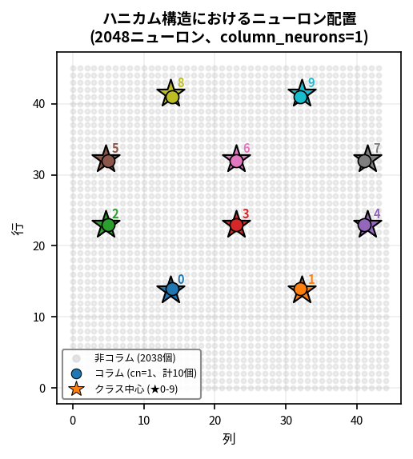
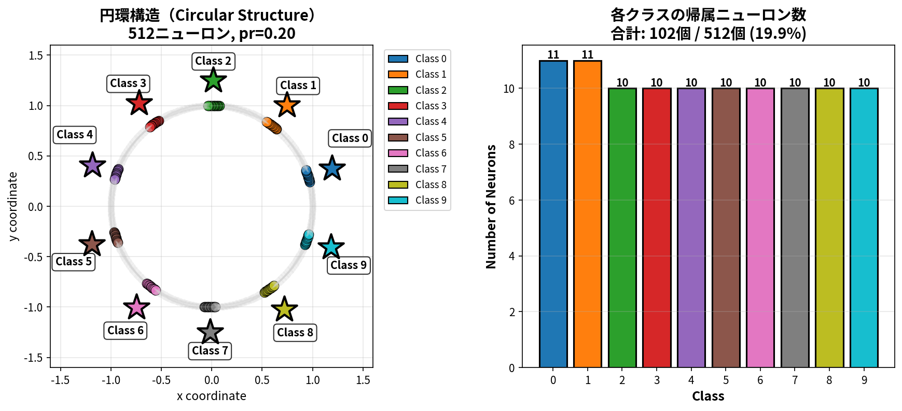
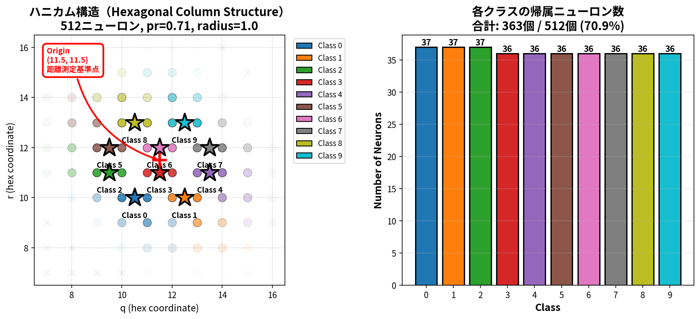
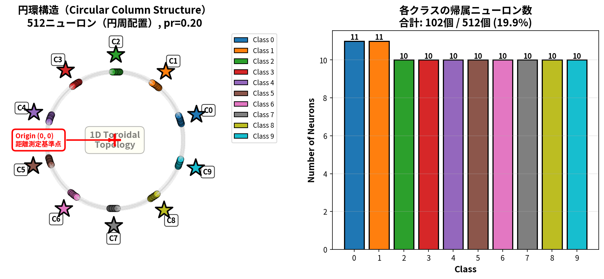

# **【 コラムED法 】 - コラム構造を持つED法**

[](https://www.python.org/)
[](https://numpy.org/)

## プロジェクト概要

- 「微分の連鎖律を用いた誤差逆伝播法」を使用せずにニューラルネットワークの学習ができます。
- 1つの重み空間で多クラス分類に対応しています。
- 現在公開しているのは、ANN実装版のみになります。
- ペアプログラミングを用いて作成しています。

### 本実装の特徴

#### オリジナルED法の忠実な実装

- 「微分の連鎖律を用いた誤差逆伝播法」は人間の脳の仕組み上あり得ない動作である、という考え方のもとで金子勇氏が考案されたED法(以下、オリジナルED法)を忠実に実装しています。
- オリジナルED法の考え方に基づいて、以下のような実装を行っています。
  - 本実装全体を通して「微分の連鎖律を用いた誤差逆伝播法」を一切使用していません。
  - オリジナルED法の飽和項: `abs(z) * (1 - abs(z))` を使用しています。
  - 生物学的に妥当なアミン濃度ベースの重み更新を使用しています。

#### コラム構造の導入

- 人間の脳の大脳皮質に見られるコラム構造(詳細は後述)をオリジナルED法に導入することによって、オリジナルED法の拡張を行っています。

#### リザバーコンピューティングの導入

- 学習のフォワード処理部分では、コラムED法とリザバーコンピューティング(詳細は後述)とが協調動作しています。

## コラム構造

### コラム構造とは

- 大脳皮質の第一次視覚野や連合野で見られる柱状の構造を指す。コラム構造では、似た特性を持ったニューロンが近くに配置されている。そのため、似た特性をもったニューロン同士が情報を共有しやすく、効率的に情報処理を行うことができるとされている。[*1]<br>

&nbsp;&nbsp;&nbsp;&nbsp;&nbsp;&nbsp;[*1] 「NeUro+( ニューロプラス )」東北大学の知見✕日立の技術による脳科学ベンチャー<br>
&nbsp;&nbsp;&nbsp;&nbsp;&nbsp;&nbsp;(https://neu-brains.co.jp/neuro-plus/glossary/ka/140/)

### コラム構造導入の背景

- オリジナルED法は、基本的に二クラス分類には強いが、多クラス分類は苦手とする方式だと考えています。(これは私の主観です)
- 金子勇氏のオリジナルのCソースコードには出力クラス毎に重み空間を保持する実装サンプルもありました。そこで、この方式を実装してみたのですが、以下のような問題があることが判明したため、この方式は断念しました。(以下は問題の一部です。)
  - 各出力クラスのネットワークがバラバラ(勝手)に学習した結果の取りまとめ方法が難しい。
  - 学習効率が悪い(学習に時間がかかる)。例えば、10クラス分類で10,000データを学習させた時点で、それぞれのクラスが学習できたデータ数は10,000/10 = 1000データにしかならない。この状況は分類するクラス数が増えるごとに顕著になる。
- オリジナルED法が多クラス分類を苦手とする理由を考えた時、個々のニューロンが出力クラスと結び付いていないため、出力クラス全体の誤差に対する自ニューロンの学習方向が分からないということであると理解しました。
- そこで、出力クラスと個々のニューロンを紐付ける方法を色々と模索している中で、人間の脳の大脳皮質の視覚野などには前項「コラム構造」に記載したような特徴のあるコラム構造があることを知り、これをオリジナルED法を多クラス分類に拡張するためにうまく取り込めないかと思い試行錯誤してみた、ということが背景になります。

### 現在実装されているパラメータに関する補足

- コラムED法の実装はこれが初であるため、特にコラム構造に関連するパラメータに関しては知見が全くない状況です。
- そのため、パラメータの有効/無効性を判断するためにも現時点ではできるだけ多くのパラメータを実装しています。したがって、現時点では実験的な位置付けの実装となっています。
- 現在実装しているパラメータであっても必要が無いと判断されて先々削除されたり、逆に新たな機能が必要となって新たなパラメータが実装される可能性もあります。つまり、現在のパラメータが最善ではない可能性があり、新たなパラメータの導入で大きく進化(または変化)する可能性も秘めていると考えています。

### コラムの動作の概要

本実装では、隠れ層の各ニューロンが特定のクラスに対して選択的に応答するようにコラム構造を組み込んでいます。以下は10クラス分類の場合の説明になります。

- **コラム割り当て**: 各ニューロンは基本的に1つのクラスに割り当てられ、そのクラスに関連する誤差信号（アミン濃度）を受け取って学習します
- **空間配置**: ハニカム構造（2-3-3-2配置）の場合は10クラスを六角格子状に配置、円環構造の場合は10クラスを2次元グリッド中心の円周上に配置
- **アミン拡散**: 出力層からのアミン濃度（誤差情報）が各ニューロンに拡散し、割り当てられたクラスに対応するニューロンが優先的に学習
- **実装**: 
  - コラム構造生成<br>
   関数名: `create_column_membership()`<br>
   実装場所: `modules/column_structure.py`<br>
   呼び出し元: `RefinedDistributionEDNetwork.__init__()` メソッド内
  - アミン拡散と学習<br>
   メソッド名: `train_epoch()`<br>
   実装場所: `modules/ed_network.py`<br>
   処理内容: membershipフラグを使用したTop-K選択型アミン拡散

### リザバーコンピューティング的な特性

> **注**: 本実装は、リザバーコンピューティングの中核的な要素（隠れ層の重み固定と高次元射影）のみを活用しています。時系列データ処理やエコー状態特性などの動的な特性は含まれておらず、静的パターン認識に特化しています。

学習のフォワード処理では、コラムED法とリザバー原理（固定重み）とが協調動作しています。

#### リザバーコンピューティングとは

リザバーコンピューティングは、ネットワークの大部分を固定ランダム重み（リザバー）として保持し、出力層と少数のニューロンのみを学習させる方式です。

#### コラムED法におけるリザバーコンピューティング的アプローチ

本実装では、`column_neurons=1`の設定により、以下のようにリザバー原理が実現されています：

**512ニューロン構成の例（10クラス分類）**:

- **学習ニューロン**: 10個（各クラス1個 × 10クラス）← コラムに参加
- **固定ランダム重み（リザバー）**: 502個（512 - 10）
- **学習比率**: 約2%（10/512）

**動作原理**:

1. 入力データが512個全てのニューロンで処理される
2. 502個のリザバーニューロンは固定ランダム重みで高次元特徴を抽出
3. 10個のコラムニューロンのみがED法で学習（アミン濃度ベース重み更新）
4. 出力層が最終的な分類を実行

**実験結果**:

- MNIST: `column_neurons=1`で81.6%の精度達成
- 学習対象が全ニューロンの2%でも高い性能を実現
- リザバーの固定ランダム重みが汎化性能に貢献

#### コラムED法とリザバー原理の役割分担

本実装では、コラムED法とリザバー原理（固定重み）が以下のように協調して動作します：

| 処理段階 | 役割 | 説明 |
|---------|------|------|
| **ネットワーク構造** | コラムED法（オリジナルED法） | 多層ネットワーク構造、E/Iペア、コラム構造による拡張 |
| **学習（フォワード処理）** | コラムED法 + リザバー原理（固定重み） | **コラムED法**: 順伝播の枠組み（活性化関数、E/Iペアなど）<br>**リザバー原理**: 固定ランダム重み（502個）による高次元特徴抽出<br>**協調動作**: リザバー（502個）が固定重みで入力を射影、コラム（10個）が学習可能な重みで調整 |
| **学習（重みの更新）** | コラムED法（オリジナルED法のアミン拡散） | コラムニューロン（10個）と出力層のみをアミン拡散で更新<br>リザバー（502個）は更新なし |

**この役割分担により実現される利点**:

- **生物学的妥当性**: ED法のアミン拡散メカニズムを維持（誤差逆伝播を使わない）
- **計算効率**: リザバーによる学習対象の限定（98%のニューロンは固定）
- **高い汎化性能**: 固定ランダム重みが過学習を抑制

この発見により、コラムED法は生物学的妥当性と計算効率を両立する新しいアプローチであることが実証されました。

### コラム構造の空間配置

コラムED法では、「各ニューロンがどのクラスに応答するか」を定義するために、ニューロンとクラスを空間的に配置します。この配置により、誤差信号（アミン濃度）が適切なニューロン群に優先的に伝播され、効率的な学習が実現されます。

本実装では、2種類のコラム構造（ハニカム構造と2次元円環構造）を提供しています。それぞれ異なる空間トポロジー（ニューロンの配置構造）を持ち、ニューロンとクラスの配置方法が異なります。以下では、512ニューロンで構成される層での具体例を説明します。

#### ハニカム構造（2次元六角格子配置）


*図: ハニカム構造におけるニューロン（ドット）とクラス中心（★0-9）の配置。色の濃淡はガウス型帰属度を表し、各クラス中心に近いほど強い影響を受ける。*

##### ハニカム構造の特徴

- 512ニューロンの層では、23×23(=529)の正方形の六角格子上に以下のようにニューロンを配置
  - コラムに参加するニューロン数は column_neurons パラメータに基づいて決定(以下で詳細を説明)
  - 10クラス分類の場合、10個のコラムを2-3-3-2パターンでグリッド中心に配置
- 六角距離に基づく等方的な分布のため、クラス中心から等距離にあるニューロンは同じ帰属度を持つ
- この2次元空間への配置により、コラム間の空間的分離が明確

##### column_neuronsパラメータによる指定の考え方

- 512ニューロンで構成される層で、column_neurons=1 と指定した場合:
  - column_neurons=1により、各クラスが1個のニューロンを持つことを指定
  - 10クラス分類では、合計10個(10クラス x 1個/クラス)のニューロンがコラムに参加
  - 残りの502個のニューロンは固定ランダム重み（リザバー）として機能

##### 「六角距離に基づく等方的な分布」とは

- 六角距離とは、六角格子（ハニカム構造）上での2点間の距離を測る方法です。通常のユークリッド距離（直線距離）とは異なり、六角形のマス目に沿って移動する際の最短経路の長さを表します。
- 六角距離を使う理由:
  - ユークリッド距離では六角格子上で方向により不均等になる
  - 六角距離なら全方向で公平な影響範囲を保証
- 等方的な分布の意味:
  - クラス中心から同じ六角距離にあるニューロンは、方向に関係なく同じ帰属度を持つ
  - これにより円形のガウス分布を実現
- 距離の計算例: クラス中心が(11.5, 11.5)、ニューロンAが(11.5, 12.5)、ニューロンBが(12.5, 11.5)の場合
  - 両方とも六角距離=1
  - 両方とも同じaffinity値を持つ（ガウス分布: exp(-0.5 * (1/0.4)^2)）

#### 円環構造（2次元円形配置）


*図: 円環構造におけるニューロン（2次元グリッド上の配置）とクラス中心（★0-9）の配置。2次元グリッド中心から円周上に等角度間隔で配置され、視覚的に理解しやすい円形構造を実現。*

##### 円環構造の特徴

- 2次元グリッド上で各クラスを円周上に等角度間隔で配置（2次元トーラストポロジー）
- column_neurons の考え方はハニカム構造と同じ
- 各クラス中心から2次元ユークリッド距離で最も近いニューロンを選択
- トーラストポロジーのイメージに合致し、視覚的に理解しやすい
- 10クラスを円周上に等角度間隔（36度ごと）で配置（配置イメージについては上図を参照）

**トーラストポロジー**: ドーナツ型の幾何学的構造。2次元円環では、2次元グリッド上で円形配置を実現。

### コラム実装のポイント

#### ハニカム構造の場合

##### 1. クラス座標中心部への全クラスの配置

**座標中心部へ配置する目的:**  

全クラスコラムが同数程度のニューロンにアクセス可能な状態を作り、学習の公平性を確保するため
(クラスコラムをグリッドの端近くに配置すると、端近くに配置されたクラスコラムのアクセス可能なニューロン数が端から離れた位置に配置されたクラスコラムよりも少なくなってしまう)

###### クラス座標の中心化配置のイメージ図





**コードサンプル:**

```python
# 10クラスをクラス座標中心部に配置
grid_size = int(np.ceil(np.sqrt(n_hidden)))  # 例: 512ニューロン → 23×23グリッド
grid_center = grid_size / 2.0  # 11.5

# 中心化した2-3-3-2配置
class_coords = {
    0: (grid_center - 1, grid_center - 1),   1: (grid_center + 1, grid_center - 1),  # 行1: 2個
    2: (grid_center - 2, grid_center),       3: (grid_center, grid_center),           # 行2: 3個
    4: (grid_center + 2, grid_center),
    5: (grid_center - 2, grid_center + 1),   6: (grid_center, grid_center + 1),       # 行3: 3個
    7: (grid_center + 2, grid_center + 1),
    8: (grid_center - 1, grid_center + 2),   9: (grid_center + 1, grid_center + 2)    # 行4: 2個
}
```

**実装場所:** `modules/column_structure.py` - `create_hexagonal_column_affinity()` 関数

---

##### 2. 余りニューロンの適切な分配(--participation_rateで参加率を指定した場合のみ)

**この実装を行う目的:**  

ニューロン数÷クラス数で割り切れない場合の余りを、先頭クラスから順に+1個ずつ分配

**コードサンプル:**

```python
if column_neurons is not None:
    # 各クラスのニューロン数を計算（例: column_neurons=1の場合）
    neurons_per_class = column_neurons  # 1
    total_neurons = neurons_per_class * n_classes  # 1 * 10 = 10
    remainder = 0  # column_neurons指定時は余りなし
    
    for class_idx in range(n_classes):
        # 各クラスに指定された数のニューロンを割り当て
        n_neurons_for_this_class = neurons_per_class
        # （例: column_neurons=1の場合）各クラス: 1個
        
        selected = sorted_indices[:n_neurons_for_this_class]
        # ...
```

**実装場所:** `modules/column_structure.py` - `create_hexagonal_column_affinity()` 関数

---

##### 3. 2つのコラム生成モード（排他的選択）

**実装の目的:**  

コラムサイズ指定方法を明確化し、混乱を防ぐ

**この実装を行う理由:**

- **モード1（推奨）: column_neurons指定** - 明示的なニューロン数指定。リザバーコンピューティング最適値は1。
- **モード2（代替）: participation_rate指定** - 参加率指定。全ニューロンの一定割合をコラム化

- 2つのモードは**排他的**：同時指定はエラー
- デフォルト: **column_neurons=1** (HyperParamsから取得、リザバーコンピューティング最適値)
- column_radius方式は**廃止**（複雑性が高く、実用性が低いため）

**コードサンプル:**

```python
def create_column_membership(n_hidden, n_classes, participation_rate=None, 
                              use_hexagonal=True, column_neurons=None):
    """
    使用例:
        # モード1: column_neurons指定（推奨、デフォルト）
        membership = create_column_membership(1024, 10, column_neurons=1)
        # → 各クラス1個、リザバーコンピューティング最適
        
        # モード2: participation_rate指定（代替）
        membership = create_column_membership(1024, 10, participation_rate=0.71)
        # → 71%のニューロンがコラムに参加、各クラス約72個
        
        # エラーケース: 両方指定
        # membership = create_column_membership(1024, 10, 
        #                                       column_neurons=1, 
        #                                       participation_rate=0.71)
        # → エラー: 排他的選択、同時指定不可
    """
    if column_neurons is not None:
        # モード1実行
        neurons_per_class = column_neurons
    elif participation_rate is not None:
        # モード2実行
        neurons_per_class = int(n_hidden * participation_rate / n_classes)
    else:
        # デフォルト: column_neurons=1
        neurons_per_class = 1
```

**実装場所:** `modules/column_structure.py` - `create_column_membership()` 関数

---

## クイックスタート

### インストール

```bash
# リポジトリのクローン
git clone https://github.com/yoiwa0714/columnar_ed_ann.git
cd columnar_ed_ann

# 仮想環境の作成 (推奨)
python -m venv [仮想環境名]
または
python3 -m venv [仮想環境名]

(例) python -m venv myenv ← myenvという名前で仮想環境を作成

# 依存パッケージのインストール
pip install -r requirements.txt
```

### 基本的な実行

```bash
# 単層構造を最適パラメータで実行（MNIST）
python columnar_ed_ann.py

# 単層構造を最適パラメータで実行（Fashion-MNIST）
python columnar_ed_ann.py --dataset fashion

# CIFAR-10での実行
python columnar_ed_ann.py --dataset cifar10

# カスタムデータセットでの実行（名前指定）
python columnar_ed_ann.py --dataset my_custom_data

# カスタムデータセットでの実行（パス指定）
python columnar_ed_ann.py --dataset /path/to/my_data

# 可視化表示付きで実行
python columnar_ed_ann.py --viz --heatmap

# 学習曲線の可視化結果保存付きで実行(--vizと--save_vizを同時に指定)
python columnar_ed_ann.py --viz --save_viz viz_result

# 学習曲線とヒートマップの可視化結果保存付きで実行(--vizと--heatmap、および--save_vizを同時に指定)
python columnar_ed_ann.py --viz --heatmap --save_viz viz_result

# (注) --save_vizオプションの動作は以下のようになります。
# パスの末尾が'/'の場合: ディレクトリとして扱い、タイムスタンプ付きファイル名で保存（例: results/ → results/viz_results_20251221_153045_viz.png）
# パスの末尾が'/'以外の場合: ベースファイル名として扱い、_viz.png等を追加（例: results/exp1 → results/exp1_viz.png）
# 引数無しで--save_vizのみを指定した場合: viz_results/ディレクトリにタイムスタンプ付きで保存
```

## 対応データセット

本実装は、標準データセットとカスタムデータセットの両方に対応しています。

### データローディング

データローディングにはTensorFlow Dataset APIを使用しています。

**特徴:**:

- **業界標準の採用**: 業界標準のTensorFlow Dataset APIを採用
- **再現性の保証**: `--seed`引数が常にTensorFlow Dataset APIに渡されることで再現性を保証

**4つの学習モード**:

```bash
# オンライン学習（シャッフルなし）
python columnar_ed_ann.py

# オンライン学習（シャッフルあり）
python columnar_ed_ann.py --shuffle

# ミニバッチ学習（シャッフルなし）
python columnar_ed_ann.py --batch 32

# ミニバッチ学習（シャッフルあり）
python columnar_ed_ann.py --batch 32 --shuffle
```

詳細は[TENSORFLOW_DATALOADER_GUIDE.md](TENSORFLOW_DATALOADER_GUIDE.md)を参照してください。

#### クラス名表示機能

- metadata.jsonに`class_names`フィールド追加（オプション）
- 標準データセット（MNIST, Fashion-MNIST, CIFAR-10）のクラス名組み込み
- 学習結果表示時にクラス名を使用

詳細は[CUSTOM_DATASET_GUIDE.md](CUSTOM_DATASET_GUIDE.md)を参照してください。

### 標準データセット

以下のデータセットを標準でサポートしています：

- MNIST（28x28グレースケール、10クラス、デフォルト）
- Fashion-MNIST（28x28グレースケール、10クラス）
- CIFAR-10（32x32カラー、10クラス）
- CIFAR-100（32x32カラー、100クラス）

```bash
# MNIST（デフォルト）
python columnar_ed_ann.py

# Fashion-MNIST
python columnar_ed_ann.py --dataset fashion

# CIFAR-10
python columnar_ed_ann.py --dataset cifar10
```

### カスタムデータセット

- カスタムデータセットに対応しています。任意の画像データセットを使用できます。
- すべてのカスタムデータセットでの検証は行えないため、動作しないケースがあるかもしれません。

#### カスタムデータセットの準備

以下のディレクトリ構造でデータセットを準備してください：

```bash
my_custom_data/
├── metadata.json       # メタデータ（必須）
├── x_train.npy        # 訓練データ（必須）
├── y_train.npy        # 訓練ラベル（必須）
├── x_test.npy         # テストデータ（必須）
└── y_test.npy         # テストラベル（必須）
```

#### metadata.json形式

```json
{
    "name": "my_custom_data",
    "n_classes": 10,
    "input_shape": [28, 28],
    "normalize": true,
    "description": "データセットの説明（オプション）"
}
```

#### カスタムデータセットの配置場所

以下のいずれかに配置できます：

1. 標準ディレクトリ（推奨）: `~/.keras/datasets/my_custom_data/`
2. 任意のパス: `/path/to/my_custom_data/`
3. カレントディレクトリ: `./my_custom_data/`

#### カスタムデータセットの使用例

```bash
# 名前指定（標準ディレクトリから自動検索）
python columnar_ed_ann.py --dataset my_custom_data

# パス指定
python columnar_ed_ann.py --dataset /path/to/my_custom_data
```

#### カスタムデータセット自動検出機能

以下の機能が自動的に動作します：

- 入力次元の自動検出（784, 3072, など）
- クラス数の自動検出（10, 100, など）
- ネットワーク構造の自動調整

#### カスタムデータセットの検証機能

カスタムデータセット読み込み時に以下の検証が自動的に実行されます：

1. データ型チェック（NumPy配列であることを確認）
2. 欠損値チェック（NaNやInfが含まれていないか確認）
3. ラベル範囲チェック（0からn_classes-1の範囲内か確認）
4. 整合性チェック（訓練データとテストデータの次元が一致するか確認）
5. クラス分布の表示（各クラスのサンプル数を表示）

- この検証はカスタムデータセットのみで実行され、標準データセット（MNIST等）ではスキップされます。

#### エラーハンドリング・処理パフォーマンス向上

**詳細なエラー診断**:

- **metadata.json解析**: JSON解析エラーの行番号・列番号表示、必須フィールド検証、型チェック
- **データセットパス**: 類似データセット候補の自動提案、使用方法のガイド表示
- **データ検証**: NaN/Inf位置の特定、範囲外ラベルの詳細、具体的な修正方法の提示
- **データファイル**: 欠損ファイルの一括表示、トラブルシューティング情報

**処理パフォーマンス向上**:

- **メモリマップモード**: 100MB以上のデータセットで自動適用（`np.load mmap_mode='r'`）
- **メモリ効率**: サンプル数制限の早期適用、不要なコピーの削減
- **進捗表示**: 大規模データセット読み込み時の状態メッセージ

## ディレクトリ構造

```bash
/
├── columnar_ed_ann.py              # メイン実装ファイル
├── README.md                       # 本ファイル
├── LICENSE                         # ライセンスファイル
├── requirements.txt                # 依存パッケージ情報
├── docs/                           # 関連ドキュメント
│   ├── en/                         # 英語ドキュメント
│   │   ├── ED_Method_Explanation.md
│   │   ├── EDLA_Isamu_Kaneko.md
│   │   └── fig*.gif
│   └── ja/                         # 日本語ドキュメント
│       ├── ED法_解説資料.md
│       ├── EDLA_金子勇氏.md
│       └── fig*.gif
├── modules/                        # モジュール化された実装
│   ├── __init__.py
│   ├── activation_functions.py     # 活性化関数
│   ├── amine_diffusion.py          # アミン拡散機構
│   ├── column_structure.py         # コラム構造生成
│   ├── data_loader.py              # データセット読み込み
│   ├── ed_network.py               # EDネットワーク本体
│   ├── hyperparameters.py          # YAMLパラメータ読み込み
│   ├── neuron_structure.py         # E/Iペア構造
│   └── visualization_manager.py    # 可視化機能
├── config/                         # 設定ファイル
│   ├── hyperparameters.yaml        # パラメータテーブル（編集可能）
│   └── hyperparameters_initial.yaml # パラメータテーブル（初期状態・リファレンス用）
├── images/                         # コラム構造図などの画像ファイル
└── original-c-source-code/         # 金子勇氏 オリジナルED法のCソースコード
```

## パラメータのデフォルト値の設定

グリッドサーチにより得られた「隠れ層数ごとのパラメータ」をデフォルト値として**外部YAMLファイル（`config/hyperparameters.yaml`）で管理**しています。そのため、ED法関連やコラム関連のパラメータを全く指定しなくてもこの外部YAMLファイルからパラメータが読み込まれるため、ある程度高い学習精度が得られるようになっています。

- ただし、十分な量のグリッドサーチを行えているわけではないため、外部YAMLファイルに記述されているパラメータが最適とは限りません。
- もしご自身で最適値を発見してそれをデフォルト値に設定したい場合には、外部YAMLファイルをエディター等で編集してください。
- コマンドラインオプションで指定したパラメータは、YAMLファイルに記述されているパラメータよりも優先されます。
- 万が一外部YAMLファイルを壊してしまった時は、config/hyperparameters_initial.yamlが初期状態のパラメータテーブルになるため、hyperparameters.yamlとしてコピーすることで初期状態に戻すことができます。

1. **設定ファイルの場所**

   - メイン設定: `config/hyperparameters.yaml`（編集可能）
   - 初期状態: `config/hyperparameters_initial.yaml`（誤編集時の復元に使用可）

2. 隠れ層が1層から5層の構成の場合のパラメータを外部YAMLファイルで保持しています。

3. 実行時に隠れ層の層数が自動判別され、YAMLファイルに設定してあるパラメータが自動的に適用されます。なお、コマンドラインオプションで指定したパラメータは、YAMLファイルに指定されているパラメータよりも優先されます。

4. パラメータのうち、隠れ層が1層と2層の構成についてはグリッドサーチによりある程度の最適化ができています。3層から5層の構成については暫定値が設定されており、今後のバージョンアップにより学習精度が向上する可能性があります。

5. 隠れ層6層以上の構成の場合のパラメータはYAMLファイルに設定されていません。隠れ層6層以上が指定された場合には隠れ層5層のパラメータが使用されます。そのため、学習精度が低い場合には--lr等のオプション機能を使ってパラメータを個々に指定していただくことになります。

6. YAMLファイルに設定されているパラメータは、`--list_hyperparams`オプションを指定して実行することで表示させることができます。

7. **パラメータのカスタマイズ方法**
   - `config/hyperparameters.yaml`をエディターで直接編集してください
   - YAMLファイルに構文エラーがある場合、プログラム起動時（モジュールimport時）にエラーメッセージが表示されます

### 実行関連のパラメータ

| パラメータ | 値 | 備考 |
|-----------|-----|------|
| `--train` | 3000 | 訓練サンプル数 |
| `--test` | 1000 | テストサンプル数 |
| `--epochs` | 40-50 | エポック数（層数により自動設定: 1層=40, 2層=45, 3-5層=50） |
| `--seed` | 42 | 乱数シード（再現性確保用） |
| `--dataset` | mnist | データセット名（mnist, fashion, cifar10, cifar100）またはカスタムデータセットのパス |
| `--fashion` | - | Fashion-MNISTを使用（後方互換性のため残存、--dataset fashionを推奨） |
| `--batch` | None | ミニバッチサイズ（未指定=オンライン学習、32/128推奨） |
| `--shuffle` | - | データシャッフル（TensorFlow Dataset API使用、オンライン/ミニバッチ両対応、フラグ） |

**学習モード**:

- 引数なしの場合 → オンライン学習（シャッフルなし）
- `--shuffle` → オンライン学習（シャッフルあり、batch_size=1）
- `--batch N` → ミニバッチ学習（シャッフルなし）
- `--batch N --shuffle` → ミニバッチ学習（シャッフルあり）

### ED法関連のパラメータ

| パラメータ | 値 | 備考 |
|-----------|-----|------|
| `--hidden` | 512 | 隠れ層ニューロン数 |
| `--lr` | 0.20 | 学習率 |
| `--u1` | 0.5 | アミン拡散係数 |
| `--u2` | 0.8 | アミン拡散係数（隠れ層間） |
| `--lateral_lr` | 0.08 | 側方抑制の学習率 |
| `--gradient_clip` | 0.05 | gradient clipping値 |
| `--wis` | None | 重み初期化係数（層ごとに指定、優先順位: CLI > HyperParams > デフォルト） |

**重み初期化係数（--wis）の使用例**:

- 隠れ層と出力層の重み初期化係数を指定します。
- 繰り返し記法に対応しています。

```bash
# 2層構成（隠れ層2層 + 出力層）
--wis 2.25,2.75,12.00

# 10層構成（繰り返し記法: 3.0を9回）
--wis 2.25,3.0[9],12.00

# 100層構成
--wis 2.0,3.0[99],12.00
```

### コラム関連のパラメータ

| パラメータ | デフォルト値 | 備考 |
|-----------|-----|------|
| `--participation_rate` | None | コラム参加率（--column_neuronsと排他的、0.0-1.0） |
| `--column_neurons` | HyperParamsから1 | 各クラスの明示的ニューロン数（--participation_rateと排他的、リザバーコンピューティング推奨値=1） |
| `--use_circular` | False | コラムを2次元円環配置に（デフォルトはハニカム、フラグ） |
| `--overlap` | 0.0 | コラム間の重複度（廃止予定、現在は無効） |
| `--diagnose_column` | - | コラム構造の詳細診断を実行（フラグ） |
| `--list_hyperparams` | - | 利用可能なHyperParams設定一覧を表示（フラグ） |

### 可視化関連のパラメータ

| パラメータ | 値 | 備考 |
|-----------|-----|------|
| `--viz` | - | 学習曲線のリアルタイム可視化を有効化（フラグ） |
| `--heatmap` | - | 活性化ヒートマップの表示を有効化（--vizと併用、フラグ） |
| `--save_viz` | - | 可視化結果を保存（パス指定: 末尾"/"でディレクトリ、なしでファイル名） |

**可視化結果の保存（--save_viz）**:

```bash
# ディレクトリ指定（タイムスタンプ付きファイル名）
--save_viz results/
# 出力例: results/viz_results_20251228_153045.png

# ベースファイル名指定
--save_viz results/exp1
# 出力例: results/exp1.png

# 学習曲線とヒートマップを同時保存
--viz --heatmap --save_viz results/exp1
# 出力例: results/exp1_viz.png, results/exp1_heatmap.png

# 引数なし（デフォルトディレクトリ）
--save_viz
# 出力例: viz_results/viz_results_20251228_153045.png
```

## オリジナルED法への準拠

金子勇氏のCコードをオリジナルED法のリファレンスとし、オリジナルED法に反しない実装であることを確認済み

| 項目 | 実装 | 判定 |
|------|------|------|
| 出力層飽和項 | `np.abs(z_output) * (1.0 - np.abs(z_output))` | OK |
| 隠れ層飽和項 | `abs(z_neuron) * (1.0 - abs(z_neuron))` | OK |
| アミン拡散 | `amine_hidden = amine_output * diffusion_coef * column_affinity` | OK |
| 重み更新 | アミン濃度ベース、「微分の連鎖律」不使用 | OK |
| Dale's Principle | 興奮性・抑制性ニューロンペア | OK |
| SoftMax |出力の確率化のみに使用(順伝播)| OK |
| アミン拡散 |確率誤差（target_prob - softmax_prob）から計算| OK |

## オリジナルED法 解説資料

- [docs/ja/ED法_解説資料.md](https://github.com/yoiwa0714/columnar_ed_ann/tree/main/docs/ja/ED法_解説資料.md)

## 参考情報

- [金子勇氏 (1999) オリジナルED法 Cソースコード](https://github.com/yoiwa0714/columnar_ed_ann/tree/main/original-c-source-code/main.c)
- [大脳皮質のコラム構造について](https://neu-brains.co.jp/neuro-plus/glossary/ka/140/)

## ライセンス

[LICENSE](https://github.com/yoiwa0714/columnar_ed_ann/tree/main/LICENSE)ファイルを参照

## 著者

yoiwa0714

## 謝辞

本実装は、金子勇氏のオリジナルED法実装を参考にしています。

---

**注意**: 本実装とアイデアは、ネットワークの種類を問わず、研究・教育目的です。本実装とアイデアを商用利用する場合は、適切なライセンスを確認してください。
