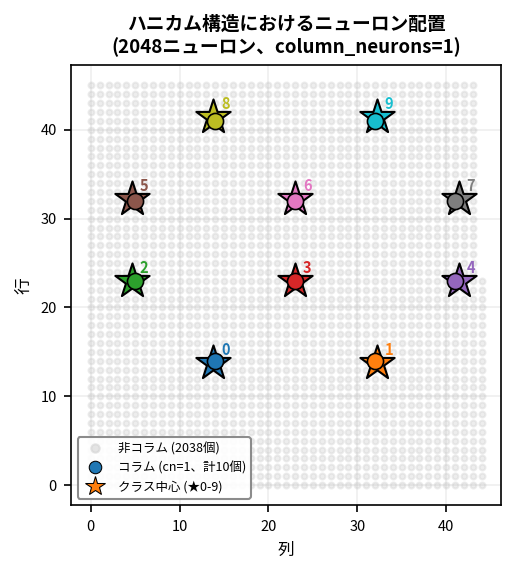

**日本語** | [English](README_en.md)

# **【 コラムED法 】** - オリジナルED法にコラム構造を導入した拡張

[](https://www.python.org/)
[](https://numpy.org/)

## 目次

- [概要](#概要)
- [対象読者と最短導線](#対象読者と最短導線)
- [特徴](#特徴)
- [クイックスタート](#クイックスタート)
- [再現性チェックリスト](#再現性チェックリスト)
- [使用例](#使用例)
  - [基本的な実行パターン](#基本的な実行パターン)
  - [可視化](#可視化)
  - [重み保存・継続学習・アンサンブル](#重み保存継続学習アンサンブル)
  - [全コマンドライン引数](#全コマンドライン引数)
- [主張と検証可能性（FAQ）](#主張と検証可能性faq)
- [動作原理](#動作原理)
  - [コラムED法とは](#コラムed法とは)
  - [オリジナルED法とは](#オリジナルed法とは)
  - [アミン拡散による重み更新](#アミン拡散による重み更新)
  - [コラム構造](#コラム構造)
  - [Gabor特徴抽出](#gabor特徴抽出)
  - [リザバーコンピューティング的特性](#リザバーコンピューティング的特性)
- [達成精度](#達成精度)
- [ディレクトリ構成](#ディレクトリ構成)
- [パラメータ自動設定](#パラメータ自動設定)
- [オリジナルED法への準拠](#オリジナルed法への準拠)
- [参考文献](#参考文献)
- [ライセンス](#ライセンス)
- [謝辞](#謝辞)

---

## 概要

**コラムED法**は、金子勇氏が考案した誤差拡散学習法（ED法、以下オリジナルED法）に、大脳皮質のコラム構造を導入することによってオリジナルED法を拡張したニューラルネットワーク実装です。

コラムED法では**微分の連鎖律を用いた誤差逆伝播法（Backpropagation）を一切使用せず**、生物学的に妥当なアミン拡散機構によって学習を行っていますが、MNIST手書き数字認識で **98.56%** のテスト精度を達成しています（3層 [2048×3]、訓練50,000サンプル）。

**`modules/` ディレクトリのモジュールだけを使用する自己完結型の実装**です。`columnar_ed_ann.py` と `modules/` だけで動作するため、ED法とコラム構造の仕組みをシンプルに理解できます。

## 対象読者と最短導線

この README は、**Python と機械学習の基礎知識はあるが、オリジナルED法/コラムED法は初見**の読者を主対象にしています。

まずは次の順で確認することを推奨します。

1. クイックスタートの最小実行を1回動かす
2. 達成精度の表で自分の実行結果とおおまかに比較する
3. 主張と検証可能性（FAQ）で「Backprop不使用」の定義と確認ポイントを読む
4. 動作原理の節に進む

---

## 特徴

### 1. 微分の連鎖律を用いた誤差逆伝播法を使用しない

従来のニューラルネットワークでは「微分の連鎖律を用いた誤差逆伝播法」で重みを更新しますが、本実装ではこれを一切使用しません。代わりに、脳の神経伝達物質（アミン）の拡散をモデル化した機構で学習を行います。

### 2. 大脳皮質のコラム構造

大脳皮質の視覚野に見られるコラム構造を導入し、一部のニューロンを特定のクラスに割り当てます。これにより、オリジナルED法が苦手としていた1つの重み空間での多クラス分類に対応しています。

### 3. Gabor特徴抽出

大脳皮質V1野の単純型細胞をモデル化したGaborフィルタによる特徴抽出を搭載しています（デフォルトON）。入力品質の向上により、適切なパラメータ設定であれば1層構成でも95%超の精度を達成します。

### 4. 生物学的に妥当な機能のみで学習

誤差関数の最小化や微分の連鎖律などの数学的な最適化理論に依存せず、生物学的に妥当な機能（アミン拡散、コラム構造、Gaborフィルタ）のみで学習を行います。

### 5. 学習が速い

MNISTでは、1エポック目で最終テスト精度の90%以上の精度に到達します。多くのエポックを繰り返す必要がなく、少ないエポック数で高い精度が得られます。

### 6. パラメータ調整が容易

パラメータ変更に対して安定的・単調的に反応し、誤差逆伝播法で見られるような勾配消失・勾配爆発による突然の学習崩壊が発生しません。パラメータが最適値から多少外れても精度が大きく下落するようなことが生じ難いため、ハイパーパラメータのチューニングが容易です。

### 7. リザバーコンピューティング的特性

各コラムに属するニューロン数を1個にした場合（`column_neurons=1`）には、リザバーコンピューティング方式での動作となります。隠れ層のコラムに属さないニューロンを固定ランダム重み（リザバー）として保持し、少数のコラムニューロンのみをオリジナルED法で学習させます。`column_neurons=10`（デフォルト: 2〜3層構成）では、各クラスに10個のコラムニューロンが割り当てられ、学習に参加するニューロンが増えることで各クラスをより多様な特徴で表現できるようになります。リザバーコンピューティング的な構造（大部分が固定重み）は維持されたまま、コラムニューロンの増加により分類性能が向上します。

---

## クイックスタート

### 1. インストール

```bash
# リポジトリのクローン
git clone https://github.com/yoiwa0714/columnar_ed_ann.git
cd columnar_ed_ann

# 仮想環境の作成（推奨）
python -m venv .venv
source .venv/bin/activate  # Linux/macOS
# .venv\Scripts\activate   # Windows

# 依存パッケージのインストール
pip install -r requirements.txt
```

### 2. 実行

```bash
# デフォルト構成（2層+Gabor特徴、約10分）
python columnar_ed_ann.py --train 10000 --test 10000

# 1層構成（約3分）
python columnar_ed_ann.py --hidden 2048 --train 5000 --test 5000

# 可視化付き（学習曲線・混同行列・活性化ヒートマップ）
python columnar_ed_ann.py --train 10000 --test 10000 --viz --heatmap
```

seed=42（デフォルト）で約96〜97%のテスト精度が得られます。

> 実行時間と精度は環境依存です。表の値はベンチマーク条件での代表値です。

## 再現性チェックリスト

- OS / Python バージョン / CPU・GPU を記録する
- `--seed` を固定する（デフォルト42）
- `--train` `--test` `--epochs` を明示する
- `config/hyperparameters.yaml` の変更有無を記録する
- 可視化あり/なし（`--viz` `--heatmap`）を明記する

上記を固定すると、README記載値との差を説明しやすくなります。

### 3. 結果確認

実行が完了すると、以下のような結果が表示されます：

```
======================================================================
学習完了
======================================================================
最終精度: Train=0.9714, Test=0.9685
ベスト精度: Test=0.9685 (Epoch 10)
```

---

## 使用例

### 基本的な実行パターン

```bash
# 1層+Gabor特徴（約3分）
python columnar_ed_ann.py --hidden 2048 --train 10000 --test 10000
# → Best ≈ 96.13% / Final ≈ 96.13%

# 2層+Gabor特徴（デフォルト構成、約10分）
python columnar_ed_ann.py --train 10000 --test 10000
# → Best ≈ 96.85% / Final ≈ 96.84%

# 3層+Gabor特徴（約30分）
python columnar_ed_ann.py --hidden 1024,1024,1024 --train 10000 --test 10000
# → Best ≈ 96.78% / Final ≈ 96.78%

# Gabor無し（オリジナルED法の純粋な学習力を確認）
python columnar_ed_ann.py --hidden 2048 --train 10000 --test 10000 --no_gabor
# → Best ≈ 90.37% / Final ≈ 90.37%
```

### 可視化

```bash
# リアルタイム学習曲線を表示
python columnar_ed_ann.py --hidden 2048 --train 5000 --test 5000 --viz

# 学習曲線 + 隠れ層・出力層ヒートマップ
python columnar_ed_ann.py --hidden 2048 --train 5000 --test 5000 --viz --heatmap

# 可視化結果をディレクトリに保存
python columnar_ed_ann.py --hidden 2048 --train 5000 --test 5000 --viz --heatmap --save_viz results/
```

### その他のオプション

```bash
# Fashion-MNIST
python columnar_ed_ann.py --hidden 2048 --train 5000 --test 5000 --dataset fashion
```

### 重み保存・継続学習・アンサンブル

```bash
# 学習完了後に重みを保存（weights/run1/ に自動作成）
python columnar_ed_ann.py --hidden 2048 --train 10000 --test 10000 --save_weights run1

# ベスト精度更新時のみ保存（エポック中随時上書き）
python columnar_ed_ann.py --hidden 2048 --train 10000 --test 10000 --save_best best_run

# 保存済み重みを読み込んで継続学習
python columnar_ed_ann.py --hidden 2048 --train 20000 --test 10000 --load_weights run1 --save_weights run1_cont

# 複数の重みをアンサンブル推論（学習なし）
python columnar_ed_ann.py --hidden 2048 --train 10000 --test 10000 \
    --ensemble run1,run1_cont
```

> **保存ファイル形式**: `weights/run1/weights_run1.npz`（重み行列）+ `weights_run1.yaml`（構成・精度情報）のペア形式。同名ファイルが既に存在する場合は対話プロンプトで確認します（`--save_overwrite` で自動上書き）。

#### リポジトリ同梱の学習済み重みを使う

このリポジトリには MNIST で Best Test=98.12% を達成した重みが含まれています（`weights/best_mnist_6layer/`）。クローン直後からそのまま継続学習に利用できます。

```bash
# 同梱の重みから継続学習（追加データで精度向上を狙う）
python columnar_ed_ann.py \
    --hidden 1024,1024,1024,1024,2048,2048 --train 20000 --test 20000 \
    --load_weights weights/best_mnist_6layer \
    --save_best weights/my_best
```

### 全コマンドライン引数

各引数の右側に短縮形 (`--gc` など) を記載しています。`--gradient_clip 0.001` と `--gc 0.001` は等価です。

**実行設定:**

| 引数 | 短縮形 | デフォルト | 説明 |
|------|--------|-----------|------|
| `--hidden` | | `2048,1024` | 隠れ層ニューロン数（カンマ区切り、例: `2048`=1層, `2048,1024`=2層） |
| `--train` | | `10000` | 訓練サンプル数 |
| `--test` | | `10000` | テストサンプル数 |
| `--epochs` | | YAML自動 | エポック数 |
| `--seed` | | `42` | 乱数シード |
| `--dataset` | | `mnist` | データセット名（`mnist`, `fashion`, `cifar10`）またはカスタムデータパス（詳細は [CUSTOM_DATASET_GUIDE.md](CUSTOM_DATASET_GUIDE.md)） |

**ネットワーク構成:**

| 引数 | 短縮形 | デフォルト | 説明 |
|------|--------|-----------|------|
| `--init_scales` | `--is` | YAML自動 | 層別重み初期化スケール（カンマ区切り、長さ=層数+1） |
| `--hidden_sparsity` | `--hs` | YAML自動 | 層別非コラム重みスパース率（カンマ区切り） |
| `--layer_column_neurons` | `--lcn` | YAML自動 | 層別コラムニューロン数（カンマ区切り、0=全コラム化） |

**学習率:**

| 引数 | 短縮形 | デフォルト | 説明 |
|------|--------|-----------|------|
| `--output_lr` | `--olr` | YAML自動 | 出力層学習率 |
| `--non_column_lr` | `--ncl` | YAML自動 | 層別非コラム学習率（カンマ区切り） |
| `--column_lr_factors` | `--clf` | YAML自動 | コラムニューロン学習率倍率（層別、カンマ区切り） |
| `--gradient_clip` | `--gc` | YAML自動 | 勾配クリッピング閾値 |
| `--u1` | | YAML自動 | アミン拡散係数u1（出力層→最終隠れ層） |
| `--u2` | | YAML自動 | アミン拡散係数u2（隠れ層間、多層時） |

**Gabor特徴抽出:**

| 引数 | 短縮形 | デフォルト | 説明 |
|------|--------|-----------|------|
| `--no_gabor` | | OFF | Gabor特徴抽出を無効化（デフォルトはON） |
| `--gabor_orientations` | `--go` | YAML自動 | Gaborフィルタ方位数 |
| `--gabor_frequencies` | `--gf` | YAML自動 | Gaborフィルタ周波数帯域数 |
| `--gabor_kernel_size` | `--gks` | YAML自動 | Gaborフィルタカーネルサイズ |

**可視化:**

| 引数 | 短縮形 | デフォルト | 説明 |
|------|--------|-----------|------|
| `--viz [SIZE]` | | OFF | リアルタイム学習曲線を表示。サイズ指定可: 1=基準, 2=1.3倍, 3=1.6倍, 4=2倍。省略時は1（`--viz` == `--viz 1`） |
| `--heatmap` | | OFF | ヒートマップ表示（`--viz`と併用） |
| `--save_viz [PATH]` | | なし | 可視化結果の保存先。パス省略時は `viz_results` に保存（`--save_viz` == `--save_viz viz_results`） |

**重み保存・継続学習・アンサンブル:**

| 引数 | デフォルト | 説明 |
|------|-----------|------|
| `--save_weights PATH` | なし | 学習完了後に重みを保存するディレクトリ（単純名指定時は `weights/` 下に自動配置） |
| `--save_best PATH` | なし | ベスト精度更新時のみ保存（`--save_weights` と同時指定可） |
| `--save_overwrite` | OFF | 同名ファイルへの上書きを許可（未指定時は対話確認） |
| `--load_weights PATH` | なし | 保存済み重みを読み込んで継続学習を開始 |
| `--ensemble PATHS` | なし | カンマ区切りで複数の重みを指定してアンサンブル推論（学習なし） |

**訓練制御（実験的）:**

以下のパラメータはデフォルト `0.0` で無効です。CLI指定で有効化されます。

| 引数 | 短縮形 | デフォルト | 説明 |
|------|--------|-----------|------|
| `--layer_gc` | `--lgc` | なし | 層別勾配クリッピング（カンマ区切り、`--gc`より優先） |
| `--lut_base_rate` | | `0.0` | LUTのベース学習率（ランク外ニューロンの最低学習率） |
| `--output_weight_decay` | | `0.0` | 出力層の重み減衰率 |
| `--output_gradient_clip` | | `0.0` | 出力層の勾配クリッピング閾値 |
| `--uncertainty_modulation` | | `0.0` | 不確実性変調の強度（出力エントロピーでアミン信号を増強） |
| `--hc_strength` | | `0.0` | 水平結合の強度（同クラスコラムニューロン間のゲイン変調） |
| `--skip` | | なし | スキップ接続（`src,dst,alpha`形式、複数指定可） |
| `--li_strength` | | `0.0` | ハード側抑制の強度（勝者コラム以外を減衰） |
| `--li_soft_temp` | | `0.0` | ソフト側抑制の温度 |
| `--hebb_strength` | | `0.0` | コラム内ヘブ強化の強度 |
| `--nc_hebb_lr` | | `0.0` | NCヘブ自己組織化の学習率 |
| `--prediction_error_strength` | | `0.0` | 層間予測エラー伝播の強度 |
| `--input_gate_strength` | | `0.0` | L6フィードバック入力ゲートの強度 |
| `--attention_boost_strength` | | `0.0` | L1注意ブーストの強度 |

**その他:**

| 引数 | 短縮形 | 説明 |
|------|--------|------|
| `--list_hyperparams` | `--lh` | YAMLのパラメータ一覧を表示して終了（`--lh 2` で2層詳細） |
| `--show_train_errors` | | 学習後に最終エポックの不正解サンプルを一覧表示 |
| `--max_errors_per_class` | | 不正解表示のクラスごと上限数（デフォルト: 20） |
| `--diagnose_plateau` | | 各エポック終了時に学習停滞診断情報を出力 |

## 主張と検証可能性（FAQ）

### Q1. 「Backpropを使っていない」の定義は？

本プロジェクトでは、**微分の連鎖律に基づく誤差逆伝播を重み更新に使わない**ことを指します。
誤差信号はアミン拡散とコラム構造に基づいて局所的に更新されます。

### Q2. どこを見れば確認できる？

- 学習本体: `modules/ed_network.py`
- 活性化・補助関数: `modules/activation_functions.py`
- 動作説明: `docs/ja/コラムED法_動作の流れ.md`

### Q3. 精度の再現がずれるのはなぜ？

主因は、実行環境差（CPU/GPU/ライブラリ版）、データ数、エポック数、可視化有無、YAML設定差です。
まずは再現性チェックリストを満たして比較してください。

---

## 動作原理

> 📖 コード内部の動作フローとコアアルゴリズムの詳細解説は **[コラムED法 動作の流れ](docs/ja/コラムED法_動作の流れ.md)** を参照してください。
>
> 🔗 Mermaidによるコードアンカー付きフロー図は **[ED学習メカニズム（Mermaidアンカー・日本語）](docs/ja/ed_learning_mechanism_anchors.md)** を参照してください。
>
> 📘 数式ベースの詳細定式化は **[コラムED法の動作原理詳細](docs/ja/コラムED法の動作原理詳細.md)** を参照してください（英語版: **[Columnar ED Method: Detailed Principles](docs/en/Columnar_ED_Method_Detailed_Principles.md)**）。

### コラムED法とは

**コラムED法（Columnar Error Diffusion Method）** は、金子勇氏が考案したオリジナルED法のニューラルネットワークに、大脳皮質のコラム構造を導入した拡張実装です。

オリジナルED法は、脳の神経伝達物質の拡散をモデル化した生物学的に妥当な学習アルゴリズムですが、2クラス分類を前提として設計されていたため、10クラス以上の多クラス分類を行うことが困難でした。その原因は、ネットワーク内の隠れ層ニューロンがどの出力クラスに寄与するのかという情報を持っていなかったことにあります。

コラムED法では、大脳皮質に見られるコラム構造を導入し、隠れ層の**コラムニューロン**と**出力クラスニューロン**の対応関係を明確にしました。これにより、各コラムニューロンが特定のクラスの学習信号のみを受け取る仕組みが実現し、1つのネットワーク（重み空間）で多クラス分類が可能になりました。

さらに、大脳皮質V1野の単純型細胞をモデル化したGaborフィルタによる特徴抽出を組み合わせることで、学習メカニズム自体を変更することなく、テスト正解率が約6%向上しています（MNIST 1層: 90.37% → 96.13%）。

### オリジナルED法とは

**誤差拡散学習法（Error Diffusion Learning Algorithm: オリジナルED法）** は、金子勇氏が1999年に考案したニューラルネットワークの学習アルゴリズムです。

現在のニューラルネットワーク学習方法の主流である「微分の連鎖律を用いた誤差逆伝播法（BP法）」は、ネットワークの出力と正解データとの誤差を計算し、その結果を微分の連鎖律を用いて出力層から入力層に向かって逆方向に伝播させることで、各層のニューロンの重みとバイアスを効率的に更新するというものです。

しかし、オリジナルED法を考案された金子勇氏は、この生物学的に不自然な学習方法を受け入れることができず、生物学的に妥当な脳の神経伝達物質（ノルアドレナリン、ドーパミン等のアミン系物質）が空間に拡散する現象をモデル化し、オリジナルED法を開発されました。オリジナルED法では、アミン系物質の拡散情報に基づいて各層が**独立して**重みを更新します。

**BP法との本質的な違い:**

| | BP法（誤差逆伝播法） | オリジナルED法（誤差拡散学習法） |
|---|---|---|
| 誤差の伝播 | 微分の連鎖律で軸索を逆流 | アミン濃度として空間に拡散 |
| 各層の学習 | 後段の勾配に依存 | **各層が独立して学習** |
| 生物学的妥当性 | 低い | 高い |

> 詳細は [docs/ja/ED法_解説資料.md](docs/ja/ED法_解説資料.md) を参照してください。

### アミン拡散による重み更新

オリジナルED法の学習は、以下の手順で行われます：

```
1. 順伝播: 入力 → 隠れ層(tanh) → 出力層(SoftMax) → 予測
2. 誤差計算: 正解クラスの確率誤差 → アミン濃度に変換
3. アミン拡散: 出力層 → 隠れ層（コラム構造に沿って選択的に拡散）
4. 重み更新: アミン濃度 × 飽和抑制項 × 入力 で各層が独立に更新
```

**飽和抑制項**（オリジナルED法の核心）:

```
飽和抑制項 = |z| × (1 - |z|)
```

- これはシグモイド微分 `z(1-z)` でも tanh微分 `1-z²` でもありません
- ニューロンの活性値 `z` が飽和（±1に近い）するほど更新量が小さくなる仕組みです
- 微分の連鎖律を使わずに、各層が独立して適切な更新量を決定できます

### コラム構造

大脳皮質の第一次視覚野や連合野には、似た特性を持つニューロンが柱（コラム）状に集まった構造が見られます[*1]。本実装では、この構造を取り入れることでオリジナルED法の多クラス分類能力を拡張しています。

**コラム構造の動作:**

1. 隠れ層のニューロンをハニカム構造（2-3-3-2配置）で2次元空間に配置
2. 各クラスのコラム中心を空間上に配置（10クラスなら10個）
3. コラム中心に最も近いニューロンがそのクラスの**コラムニューロン**として割り当てられる
4. 学習時、正解クラスのコラムニューロンのみがアミン信号を受け取って重みを更新
5. コラムに属さないニューロンは固定ランダム重みのまま保持される（`column_neurons`の設定により学習ニューロン数は変わる）



*図: ハニカム構造におけるニューロン配置（2048ニューロン、column_neurons=1）。グレーの点が非コラムニューロン（2038個）、色付きの点がコラムニューロン（10個）、★がクラス中心（0-9）*

```
[*1] 「NeUro+(ニューロプラス)」東北大学の知見✕日立の技術による脳科学ベンチャー
     (https://neu-brains.co.jp/neuro-plus/glossary/ka/140/)
```

### Gabor特徴抽出

大脳皮質V1野（第一次視覚野）の単純型細胞は、特定の方位と周波数のエッジに選択的に反応します。本実装では、これをGaborフィルタでモデル化し、入力画像の特徴を抽出します（デフォルトON）。

**フィルタ構成:**
- 8方位 × 2周波数 = 16 Gaborフィルタ + 2 Sobelエッジフィルタ = **18フィルタ**
- カーネルサイズ: 11×11、プーリング: 4×4平均プーリング
- 出力次元: 784 → 882（MNIST 28×28の場合）

**効果:** Gabor特徴により、1層構成でもMNIST 90.37% → 96.13%（+5.76%）に向上します。学習メカニズム自体は変更せず、入力品質の向上によって精度を改善する生物学的に妥当なアプローチです。

### リザバーコンピューティング的特性

`column_neurons=1`（デフォルト: 1層構成）の設定では、本実装はリザバーコンピューティングと同等の動作原理で機能します。

**なぜcn=1でリザバーコンピューティングになるのか:**

`column_neurons=1`は各クラスに1個のコラムニューロンを割り当てる設定です。2048ニューロンの隠れ層で10クラス分類を行う場合、学習対象になるのはわずか10個（全体の0.5%）で、残り2038個のニューロンは初期化時のランダム重みが固定されたまま変化しません。

この構成は、リザバーコンピューティングの基本原理と正確に一致します：

| リザバーコンピューティング | コラムED法（cn=1） |
|---|---|
| **リザバー**: 固定ランダム結合で入力を高次元空間に射影 | **非コラムニューロン（2038個）**: 固定ランダム重みで入力を高次元空間に射影 |
| **読み出し層**: リザバーの出力から分類境界を学習 | **出力層**: 隠れ層全体の活性化パターンから分類を学習 |

固定ランダム重みのニューロン群は、入力データを高次元の非線形空間にランダム射影する役割を果たします。異なるランダム重みを持つ各ニューロンが入力の異なる側面に反応するため、元の入力空間では線形分離が困難なパターンでも、高次元射影後には分離しやすくなります。出力層はこの射影された表現から分類境界を学習するだけでよいため、少数のニューロンの学習だけで高い分類精度を達成できます。

この構成により、コラムED法は生物学的妥当性（少数のニューロンのみが学習）と高い汎化性能（固定重みによる過学習抑制）を両立しています。

**cn>1の場合:**

例えば`column_neurons=10`（デフォルト: 2〜3層構成）では、各クラスに10個のコラムニューロンが割り当てられます。2048ニューロンの隠れ層では100個（全体の約4.9%）が学習対象となり、残り1948個が固定ランダム重みを保持します。

cn=1と比較すると、学習に参加するニューロンが増えることで各クラスをより多様な特徴で表現できるようになります。リザバーコンピューティング的な構造（大部分が固定重み）は維持されたまま、コラムニューロンの増加により分類性能が向上します。

### 大脳皮質6層構造の機能分化

大脳皮質は解剖学的に6つの層（L1〜L6）に分かれており、各層が異なる機能的役割を担っています。本実装では、この機能分化を以下の3つのパラメータで模倣できます。

| パラメータ | 生物学的対応 | 推奨設定（6層の場合） |
|---|---|---|
| `--lcn 0,10,...` | L4（感覚入力層）は入力を汎用的に受容 | 入力層のみ`0`（全ニューロンをコラム化）、他層は`10` |
| `--is 0.7,1.2,...,2.2,0.8` | L5（行動出力層）は皮質で最も厚い | 出力近傍層ほど大きな値に設定 |
| `--hs 0.6,0.6,...,0.2,0.2` | L1（分子層）は疎、L5（錐体細胞層）は密 | 浅層を高スパース（0.6）、深層を低スパース（0.2）に設定 |

これらの分化設定により、均一パラメータ構成から最大+0.39%の精度向上が達成されており、生物学的妥当性と精度改善が一致する結果となっています。

---

## 達成精度

MNIST手書き数字認識での実験結果（seed=42、再現可能）:

### Gabor特徴あり（デフォルト）- 10kサンプル

均一構成 [1024×N] + 層機能分化パラメータ（`--lcn`, `--is`, `--hs`）を使用した結果です。

| 構成 | 隠れ層 | テスト精度 | 実行時間 (※) |
|------|--------|-----------|----------------|
| 1層 | [1024] | Best 96.77% | 約1分 |
| 2層 | [1024×2] | Best 96.93% | 約2分 |
| 3層 | [1024×3] | Best 96.78% | 約3分 |
| 4層 | [1024×4] | Best 96.51% | 約4分 |
| 5層 | [1024×5] | Best 96.57% | 約5分 |
| 6層 | [1024×6] | Best 96.42% | 約6分 |

### Gabor特徴あり - 20kサンプル

| 構成 | 隠れ層 | テスト精度 | 実行時間 (※) |
|------|--------|-----------|----------------|
| 1層 | [1024] | Best 97.17% | 約2分 |
| 2層 | [1024×2] | Best 98.03% | 約5分 |
| 3層 | [1024×3] | Best 97.66% | 約8分 |
| 4層 | [1024×4] | Best 97.78% | 約10分 |
| 5層 | [1024×5] | Best 97.80% | 約13分 |
| 6層 | [1024×6] | Best 98.03% | 約37分 |
| 6層（深層拡張） | [1024×4, 2048×2] | Best 98.11% | 約40分 |

### Gabor特徴あり - 50kサンプル

| 構成 | 隠れ層 | テスト精度 | 実行時間 (※) |
|------|--------|-----------|----------------|
| 3層 | [1024×3] | Best 98.50% | 約4.2時間 |
| 3層 | [2048×3] | **Best 98.56%** ★ | 約15.8時間 |

※ 実行時間は第11世代 Core i5 / RTX 3060 環境での測定値であり、実行環境によって異なります。  
★ プロジェクト最高精度（seed=42、`--hidden 2048,2048,2048`、`--train 50000`、`--epochs 30`、`--layer_column_neurons 0,10,10`、`--init_scales 0.7,1.8,1.8,0.8`、`--hidden_sparsity 0.4,0.4,0.4`）。

> **実験条件:** seed=42（すべて同一条件で再現可能）。エポック数は `config/hyperparameters.yaml` で自動設定。

---

## ディレクトリ構成

以下は**理解に必要な主要ファイル**の要約です。
初見の方はまずこの表のファイルだけを追ってください。

```
columnar_ed_ann/
├── columnar_ed_ann.py              # ★ メインスクリプト
├── README.md                       # ★ 本ドキュメント（日本語）
├── README_en.md                    # ★ 本ドキュメント（英語）
├── LICENSE                         # ライセンス
├── requirements.txt                # 依存パッケージ
├── CUSTOM_DATASET_GUIDE.md         # カスタムデータセット利用ガイド
│
├── modules/                        # ★ モジュール群
├── config/                         # パラメータ設定ファイル
│   ├── hyperparameters.yaml        #   層数別最適パラメータ（編集可能）
│   └── hyperparameters_initial.yaml#   初期状態（復元用）
├── docs/                           # 関連ドキュメント
│   ├── ja/ED法_解説資料.md          #   オリジナルED法の詳細解説（日本語）
│   ├── ja/EDLA_金子勇氏.md          #   ED法の学術的背景と金子勇氏の業績（日本語）
│   ├── ja/コラムED法_動作の流れ.md  #   コラムED法のコア関数詳細解説（日本語）
│   ├── en/ED_Method_Explanation.md  #   オリジナルED法の詳細解説（英語）
│   ├── en/EDLA_Isamu_Kaneko.md      #   ED法の学術的背景と金子勇氏の業績（英語）
│   └── en/Columnar_ED_Method_Flow.md#   コラムED法のコア関数詳細解説（英語）
├── images/                         # コラム構造図
└── original-c-source-code/         # 金子勇氏オリジナルCソースコード
```

---

## パラメータ自動設定

隠れ層数に応じた最適パラメータが `config/hyperparameters.yaml` から自動的に読み込まれます。ユーザーが指定する必要があるのは、隠れ層構成・データサイズ・エポック数の最小限の引数のみです。

### 自動設定される主なパラメータ

| パラメータ | CLI短縮形 | 1層 | 2層 | 3層 | 説明 |
|-----------|----------|------|------|------|------|
| column_neurons | `--lcn` | 1 | 10 | 10 | コラムニューロン数 |
| init_scales | `--is` | [0.4, 1.0] | [0.7, 1.8, 0.8] | [0.7, 1.8, 1.8, 0.8] | 層別初期化スケール |
| hidden_sparsity | `--hs` | 0.4 | [0.4, 0.4] | [0.4, 0.4, 0.4] | 隠れ層スパース率 |
| output_lr | `--olr` | 0.15 | 0.15 | 0.15 | 出力層学習率 |
| non_column_lr | `--ncl` | [0.15] | [0.15, 0.15] | [0.15, 0.15, 0.15] | 隠れ層基準学習率（層別）※ |
| column_lr_factors | `--clf` | [0.01] | [0.005, 0.003] | [0.005, 0.004, 0.002] | コラムニューロン学習率倍率（層別） |
| gradient_clip | `--gc` | 0.0001 | 0.0001 | 0.0001 | 勾配クリッピング |
| u1 | `--u1` | 0.5 | 0.5 | 0.5 | アミン拡散係数（出力→最終隠れ層） |
| u2 | `--u2` | 0.8 | 0.8 | 0.8 | アミン拡散係数（隠れ層間、多層時） |
| gabor_orientations | `--go` | 8 | 8 | 8 | Gaborフィルタ方位数 |
| gabor_frequencies | `--gf` | 2 | 2 | 2 | Gaborフィルタ周波数帯域数 |
| gabor_kernel_size | `--gks` | 11 | 11 | 11 | Gaborフィルタカーネルサイズ |

> ※ `non_column_lr` は隠れ層全体の基準学習率として使用されます。非コラムニューロンはアミン信号を受け取らないため実際には学習せず、学習するのはコラムニューロン（`column_lr_factors`の倍率で更新）と出力層（`output_lr`の学習率で更新）のみです。
>
> 4層以上のパラメータも `config/hyperparameters.yaml` に定義されています。

### カスタマイズ方法

1. **CLIオプションで直接指定**: 上表の「CLI短縮形」列のオプションで実行時に上書きできます
   ```bash
   # 例: 勾配クリッピングとGaborカーネルサイズを変更
   python columnar_ed_ann.py --train 10000 --test 10000 --gc 0.001 --gks 7
   ```
   CLIで変更した項目は、実行開始時のパラメータ表示に `(変更)` と表示されます。

2. **パラメータ一覧の確認**: `--lh` で全層のYAML設定値を確認できます
   ```bash
   python columnar_ed_ann.py --lh       # 全層の一覧
   python columnar_ed_ann.py --lh 2     # 2層構成の詳細
   ```

3. **YAML直接編集**: `config/hyperparameters.yaml` をエディタで編集すると、デフォルト値自体を変更できます

> 万が一YAMLファイルを壊した場合は、`config/hyperparameters_initial.yaml` からコピーして復元できます。

---

## オリジナルED法への準拠

金子勇氏のCソースコードをリファレンスとし、オリジナルED法に準拠した実装であることを確認しています。

| 項目 | 実装 | 準拠 |
|------|------|------|
| 出力層飽和項 | `\|z\| × (1 - \|z\|)` | ✓ |
| 隠れ層飽和項 | `\|z\| × (1 - \|z\|)` | ✓ |
| アミン拡散 | コラム構造に沿った選択的拡散 | ✓ |
| 重み更新 | アミン濃度ベース、微分の連鎖律不使用 | ✓ |
| Dale's Principle | 興奮性・抑制性ニューロンペア | ✓ |
| SoftMax | 出力の確率化のみに使用（順伝播） | ✓ |

---

## 参考文献

- [オリジナルED法 解説資料（日本語）](docs/ja/ED法_解説資料.md) — オリジナルED法の理論と動作の詳細解説
- [EDLA — 金子勇氏のError Diffusion学習法（日本語）](docs/ja/EDLA_金子勇氏.md) — ED法の学術的背景と金子勇氏の業績
- [ED学習メカニズム（Mermaidアンカー・日本語）](docs/ja/ed_learning_mechanism_anchors.md) — コード行番号アンカー付きの実行パス/機能別フロー図
- [ED Learning Mechanism (Mermaid Anchors, EN)](docs/en/ed_learning_mechanism_anchors_en.md) — Code-anchored execution and feature flow diagrams
- [コラムED法の動作原理詳細](docs/ja/コラムED法の動作原理詳細.md) — 数式ベースの実装整合型定式化（日本語）
- [Columnar ED Method: Detailed Principles](docs/en/Columnar_ED_Method_Detailed_Principles.md) — Implementation-aligned mathematical formalization (English)
- [金子勇氏 (1999) オリジナルED法 Cソースコード](original-c-source-code/main.c) — 本実装の基となったオリジナル実装
- [大脳皮質のコラム構造について](https://neu-brains.co.jp/neuro-plus/glossary/ka/140/) — コラム構造の生物学的背景

---

## ライセンス

[LICENSE](LICENSE) ファイルを参照してください。

- **非商用利用**: MITライセンス（個人利用・学術研究・教育目的）
- **商用利用**: 別途商用ライセンスが必要（GitHubのIssuesで連絡）

---

## 謝辞

本実装は、金子勇氏が1999年に考案されたError-Diffusion（ED）学習法に基づいています。生物学的に妥当なニューラルネットワーク学習アルゴリズムにおける氏の先駆的な業績に対し、深い敬意と感謝の意を表します。

---

## 著者

yoiwa0714
