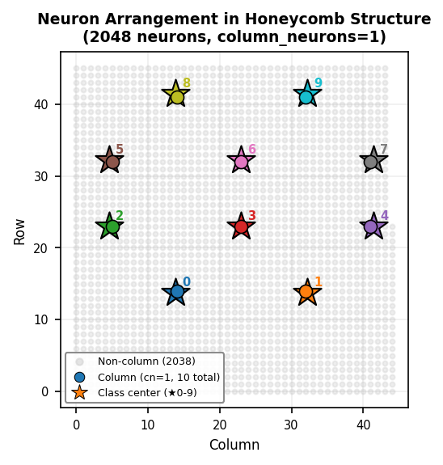

[**日本語**](README_simple.md) | **English**

# **Columnar ED Method — Simple Version: Extending Original ED Method with Column Structure**

[](https://www.python.org/)
[](https://numpy.org/)

## Table of Contents

- [Overview](#overview)
- [Features](#features)
- [Quick Start](#quick-start)
- [Usage Examples](#usage-examples)
- [How It Works](#how-it-works)
  - [What Is the Original ED Method?](#what-is-the-original-ed-method)
  - [Column Structure](#column-structure)
  - [Weight Update via Amine Diffusion](#weight-update-via-amine-diffusion)
  - [Gabor Feature Extraction](#gabor-feature-extraction)
  - [Reservoir Computing Properties](#reservoir-computing-properties)
- [Achieved Accuracy](#achieved-accuracy)
- [Directory Structure](#directory-structure)
- [Automatic Parameter Configuration](#automatic-parameter-configuration)
- [Compliance with Original ED Method](#compliance-with-original-ed-method)
- [References](#references)
- [License](#license)
- [Acknowledgments](#acknowledgments)

---

## Overview

**The Columnar ED Method** is a neural network implementation that extends the Error Diffusion learning algorithm (ED method, hereinafter referred to as the "original ED method") conceived by Isamu Kaneko, by introducing cortical column structure from the cerebral cortex.

The Columnar ED Method **does not use backpropagation based on the chain rule of derivatives at all**, and instead learns through biologically plausible amine diffusion mechanisms. Despite this, it achieves **97.08%** test accuracy on MNIST handwritten digit recognition (3-layer configuration, 10,000 training samples).

This repository provides two implementations:

| Implementation | File | Purpose |
|------|---------|------|
| **Simple version** | `columnar_ed_ann_simple.py` | Achieves high accuracy with minimal arguments. Subject of this document |
| Full version | `columnar_ed_ann.py` | Allows more parameter specifications than the simple version. See [README_en.md](README_en.md) for details |

The **simple version** removes some supplementary features from the full version, retaining only the core ED method and Gabor feature-related implementations, making it easier to understand how the ED method and Gabor features work.

---

## Features

### 1. No Backpropagation Based on the Chain Rule of Derivatives

Conventional neural networks update weights using "backpropagation based on the chain rule of derivatives," but this implementation does not use it at all. Instead, it learns through a mechanism that models the diffusion of brain neurotransmitters (amines).

### 2. Cortical Column Structure

By introducing column structure found in the visual cortex of the cerebral cortex, a subset of neurons is assigned to specific classes. This enables multi-class classification within a single weight space, which was a challenge for the original ED method.

### 3. Gabor Feature Extraction

Features Gabor filter-based feature extraction that models simple cells in the primary visual cortex (V1) of the cerebral cortex (ON by default). By improving input quality, it achieves over 95% accuracy even with a single-layer configuration given appropriate parameter settings.

### 4. Learning Using Only Biologically Plausible Functions

Learning is performed using only biologically plausible functions (amine diffusion, column structure, Gabor filters), without relying on mathematical optimization theories such as error function minimization or the chain rule of derivatives.

### 5. Fast Learning

When the training data size is sufficiently large, the model reaches over 90% of its final test accuracy within the first epoch. High accuracy is obtained with few epochs, without the need for many training iterations.

### 6. Easy Parameter Tuning

The model responds stably and monotonically to parameter changes, without the sudden learning collapse caused by vanishing/exploding gradients seen in backpropagation. Even when parameters deviate somewhat from optimal values, accuracy barely changes, making hyperparameter tuning straightforward.

### 7. Reservoir Computing Properties

When the number of neurons per column is set to 1 (`--column_neurons 1`), the implementation operates as reservoir computing. Non-column neurons in the hidden layer are maintained as fixed random weights (reservoir), and only a small number of column neurons are trained using the original ED method.

---

## Quick Start

### 1. Installation

```bash
# Clone the repository
git clone https://github.com/yoiwa0714/columnar_ed_ann.git
cd columnar_ed_ann

# Create a virtual environment (recommended)
python -m venv .venv
source .venv/bin/activate  # Linux/macOS
# .venv\Scripts\activate   # Windows

# Install dependencies
pip install -r requirements.txt
```

### 2. Run

```bash
# 1-layer + Gabor features (default, ~2 minutes)
python columnar_ed_ann_simple.py --hidden 2048 --train 5000 --test 5000

# 1-layer + Gabor features + visualization (learning curves, confusion matrix, activation heatmap)
python columnar_ed_ann_simple.py --hidden 2048 --train 5000 --test 5000 --viz 2 --heatmap
```

With seed=42 (default), you should get approximately 95% test accuracy.

### 3. Viewing Results

When execution completes, results like the following will be displayed:

```
======================================================================
Training Complete
======================================================================
Final Accuracy: Train=0.9722, Test=0.9500
Best Accuracy: Test=0.9500 (Epoch 10)
```

---

## Usage Examples

### Basic Execution Patterns

```bash
# 1-layer + Gabor features (default, ~3 minutes)
python columnar_ed_ann_simple.py --hidden 2048 --train 10000 --test 10000
# → Test ≈ 96.13%

# 2-layer + Gabor features (~10 minutes)
python columnar_ed_ann_simple.py --hidden 2048,1024 --train 10000 --test 10000
# → Test ≈ 96.85%

# 3-layer + Gabor features (~20 minutes, best MNIST accuracy)
python columnar_ed_ann_simple.py --hidden 2048,1024,1024 --train 10000 --test 10000
# → Test ≈ 97.08%

# 4-layer + Gabor features (best on Fashion-MNIST)
python columnar_ed_ann_simple.py --hidden 1024,1024,1024,1024 --train 10000 --test 10000 --dataset fashion
# → Test ≈ 96.48%

# 5-layer + Gabor features (stability-focused)
python columnar_ed_ann_simple.py --hidden 1024,1024,1024,1024,1024 --train 10000 --test 10000 --dataset fashion
# → Best ≈ 85.38%, Final ≈ 85.24%

# Without Gabor (to verify the pure learning capability of the original ED method)
python columnar_ed_ann_simple.py --hidden 2048 --train 10000 --test 10000 --no_gabor
# → Test ≈ 90.37%
```

### Visualization

```bash
# Display real-time learning curves (size levels: 1=base, 2=1.3x, 3=1.6x, 4=2x; window size)
# Omitting SIZE is equivalent to --viz 1
python columnar_ed_ann_simple.py --hidden 2048 --train 5000 --test 5000 --viz 2

# Learning curves + hidden/output layer heatmaps
python columnar_ed_ann_simple.py --hidden 2048 --train 5000 --test 5000 --viz 2 --heatmap

# Save visualization results to a directory (auto-named with timestamp)
python columnar_ed_ann_simple.py --hidden 2048 --train 5000 --test 5000 --viz 2 --heatmap --save_viz results/
# → results/viz_results_20260222_123456_viz.png     (learning curves & confusion matrix)
# → results/viz_results_20260222_123456_heatmap.png (activation heatmap)

# Save with a specified filename
python columnar_ed_ann_simple.py --hidden 2048 --train 5000 --test 5000 --viz 2 --heatmap --save_viz results/my_experiment.png
# → results/my_experiment_viz.png     (learning curves & confusion matrix)
# → results/my_experiment_heatmap.png (activation heatmap)

# Display misclassified training data (scrollable window after final epoch)
python columnar_ed_ann_simple.py --hidden 2048 --train 5000 --test 5000 --show_train_errors
```

### Other Options

```bash
# Fashion-MNIST
python columnar_ed_ann_simple.py --hidden 2048 --train 5000 --test 5000 --dataset fashion

# Manually specify column neuron count and initialization scales (overrides YAML defaults)
python columnar_ed_ann_simple.py --hidden 2048,1024 --column_neurons 10 --init_scales 0.7,1.8,0.8

# Display detailed initialization information
python columnar_ed_ann_simple.py --hidden 2048 --train 5000 --test 5000 --verbose

# Display YAML configuration
python columnar_ed_ann_simple.py --list_hyperparams
```

### All Command-Line Arguments

**Network Configuration:**

| Argument | Default | Description |
|------|-----------|------|
| `--hidden` | `2048` | Number of hidden layer neurons (e.g., `2048`=1 layer, `2048,1024`=2 layers) |
| `--train` | `5000` | Number of training samples |
| `--test` | `5000` | Number of test samples |
| `--epochs` | YAML auto | Number of epochs |
| `--seed` | `42` | Random seed |
| `--dataset` | `mnist` | Dataset name (`mnist`, `fashion`, `cifar10`) or custom data path (see [CUSTOM_DATASET_GUIDE.md](CUSTOM_DATASET_GUIDE.md) for details) |

**Visualization:**

| Argument | Default | Description |
|------|-----------|------|
| `--viz [SIZE]` | OFF | Display real-time learning curves (`1=base`, `2=1.3x`, `3=1.6x`, `4=2x` window size; omitted SIZE defaults to `1`) |
| `--heatmap` | OFF | Display heatmaps (use with `--viz`) |
| `--save_viz` | None | Directory to save visualization results |
| `--show_train_errors` | OFF | Display misclassified training data after final epoch |
| `--max_errors_per_class` | `20` | Maximum number of errors displayed per class |

**Gabor Feature Extraction:**

| Argument | Default | Description |
|------|-----------|------|
| `--no_gabor` | OFF | Disable Gabor feature extraction (ON by default) |

**Advanced Settings (automatic settings are usually sufficient):**

| Argument | Default | Description |
|------|-----------|------|
| `--column_neurons` | YAML auto | Number of column neurons |
| `--init_scales` | YAML auto | Per-layer initialization scales (e.g., `0.7,1.8,0.8`) |

**Utilities:**

| Argument | Default | Description |
|------|-----------|------|
| `--list_hyperparams` | - | Display YAML configuration (specify layers: `--list_hyperparams 2`) |
| `--verbose` | OFF | Display initialization details (weight scales, column structure, sparsity rates, etc.) |

---

## How It Works

> 📖 For a detailed walkthrough of the internal code flow and core algorithm explanations, see **[Columnar ED Method — Operational Flow](docs/en/Columnar_ED_Method_Flow.md)**.
>
> 🔗 For Mermaid-based code-anchored flow diagrams, see **[ED Learning Mechanism (Mermaid Anchors, EN)](docs/en/ed_learning_mechanism_anchors_en.md)**.

### What Is the Columnar ED Method?

**The Columnar ED Method (Columnar Error Diffusion Method)** is an extended implementation that introduces cortical column structure from the cerebral cortex into the neural network of the original ED method conceived by Isamu Kaneko.

The original ED method is a biologically plausible learning algorithm that models the diffusion of brain neurotransmitters. However, it was designed for binary classification, making it difficult to perform multi-class classification with 10 or more classes. This was because hidden layer neurons in the network had no information about which output class they contributed to.

The Columnar ED Method introduces column structure found in the cerebral cortex, establishing a clear correspondence between **column neurons** in the hidden layer and **output class neurons**. This enables each column neuron to receive learning signals only from its assigned class, making multi-class classification possible within a single network (weight space).

Furthermore, by combining Gabor filter-based feature extraction that models simple cells in the primary visual cortex (V1), test accuracy improves by approximately 6% without modifying the learning mechanism itself (MNIST 1-layer: 90.37% → 96.13%).

### What Is the Original ED Method?

**The Error Diffusion Learning Algorithm (original ED method)** is a neural network learning algorithm conceived by Isamu Kaneko in 1999.

The mainstream method for neural network learning today, "backpropagation based on the chain rule of derivatives (BP method)," computes the error between the network output and the correct data, then propagates it backward from the output layer to the input layer using the chain rule of derivatives, efficiently updating the weights and biases of each layer's neurons.

However, Isamu Kaneko, who conceived the original ED method, could not accept this biologically implausible learning method. He modeled the phenomenon of brain neurotransmitters (amine substances such as noradrenaline and dopamine) diffusing through space, and developed the original ED method. In the original ED method, each layer **independently** updates its weights based on amine diffusion information.

**Essential Differences from BP Method:**

| | BP Method (Backpropagation) | Original ED Method (Error Diffusion) |
|---|---|---|
| Error propagation | Travels backward through axons via chain rule | Diffuses through space as amine concentration |
| Layer learning | Depends on gradients from later layers | **Each layer learns independently** |
| Biological plausibility | Low | High |

> For details, see [docs/en/ED_Method_Explanation.md](docs/en/ED_Method_Explanation.md).

### Weight Update via Amine Diffusion

Learning in the original ED method proceeds as follows:

```
1. Forward pass: Input → Hidden layer (tanh) → Output layer (SoftMax) → Prediction
2. Error computation: Probability error of correct class → Converted to amine concentration
3. Amine diffusion: Output layer → Hidden layer (selectively diffused along column structure)
4. Weight update: Amine concentration × saturation suppression term × input (each layer updates independently)
```

**Saturation suppression term** (core of the original ED method):

```
saturation suppression term = |z| × (1 - |z|)
```

- This is NOT the sigmoid derivative `z(1-z)` nor the tanh derivative `1-z²`
- It is a mechanism where the update amount decreases as the neuron's activation value `z` approaches saturation (near ±1)
- Each layer can determine appropriate update amounts independently, without using the chain rule of derivatives

### Column Structure

In the primary visual cortex and association cortex of the cerebral cortex, neurons with similar characteristics are arranged in columnar structures[*1]. This implementation incorporates this structure to extend the multi-class classification capability of the original ED method.

**How column structure works:**

1. Hidden layer neurons are arranged in 2D space using a honeycomb structure (2-3-3-2 layout)
2. Column centers for each class are placed in the space (10 centers for 10 classes)
3. Neurons closest to each column center are assigned as **column neurons** for that class
4. During training, only column neurons of the correct class receive amine signals and update their weights
5. Non-column neurons retain their initial random weights as fixed (the number of learning neurons varies with the `column_neurons` setting)



*Figure: Neuron arrangement in honeycomb structure (2048 neurons, column_neurons=1). Gray dots are non-column neurons (2038), colored dots are column neurons (10), ★ marks class centers (0-9)*

```
[*1] "NeUro+ (Neuro Plus)" — A neuroscience venture by Tohoku University × Hitachi
     (https://neu-brains.co.jp/neuro-plus/glossary/ka/140/)
```

### Gabor Feature Extraction

Simple cells in the primary visual cortex (V1) of the cerebral cortex selectively respond to edges of specific orientations and frequencies. This implementation models them as Gabor filters to extract features from input images.

**Filter configuration:**
- 8 orientations × 2 frequencies = 16 Gabor filters + 2 Sobel edge filters = **18 filters**
- Kernel size: 7×7, Pooling: 4×4 average pooling
- Output dimensions: 784 → 882 (for MNIST 28×28)

**Effect:** With Gabor features, the MNIST 1-layer configuration improves from 90.37% → 96.13% (+5.76%). This is a biologically plausible approach that improves accuracy through input quality enhancement without modifying the learning mechanism itself.

### Reservoir Computing Properties

With the `column_neurons=1` setting (default for single-layer configurations), this implementation operates on the same principles as reservoir computing.

**Why cn=1 behaves as reservoir computing:**

`column_neurons=1` assigns one column neuron per class. When performing 10-class classification with a 2048-neuron hidden layer, only 10 neurons (0.5% of total) are subject to training, while the remaining 2038 neurons retain their random weights from initialization unchanged.

This configuration precisely matches the fundamental principles of reservoir computing:

| Reservoir Computing | Columnar ED Method (cn=1) |
|---|---|
| **Reservoir**: Projects input to high-dimensional space with fixed random connections | **Non-column neurons (2038)**: Project input to high-dimensional space with fixed random weights |
| **Readout layer**: Learns classification boundaries from reservoir output | **Output layer**: Learns classification from activation patterns of the entire hidden layer |

The fixed random weight neuron groups serve as random projections of input data into high-dimensional nonlinear space. Since each neuron with different random weights responds to different aspects of the input, patterns that are difficult to linearly separate in the original input space become more separable after the high-dimensional projection. The output layer only needs to learn the classification boundary from this projected representation, enabling high classification accuracy with training of only a small number of neurons.

This configuration allows the Columnar ED Method to achieve both biological plausibility (only a few neurons learn) and high generalization performance (overfitting prevention through fixed weights).

**When cn>1:**

For example, with `column_neurons=10` (default for 2+ layer configurations), 10 column neurons are assigned per class. In a 2048-neuron hidden layer, 100 neurons (about 4.9% of total) become training targets, while the remaining 1948 retain fixed random weights.

Compared to cn=1, the increased number of learning neurons allows each class to be represented by more diverse features. While the reservoir computing-like structure (majority of weights remain fixed) is maintained, the increased column neurons improve classification performance. For configurations with 2 or more layers, cn=10 is the default, achieving 97.08% accuracy with a 3-layer configuration.

---

## Achieved Accuracy

Experimental results on MNIST handwritten digit recognition (seed=42, reproducible):

### With Gabor Features (Default)

| Configuration | Hidden Layers | Test Accuracy | Runtime (*) |
|------|--------|-----------|----------------|
| 1-layer | [2048] | 96.13% | ~3 min |
| 2-layer | [2048, 1024] | 96.85% | ~10 min |
| 3-layer | [2048, 1024, 1024] | **97.08%** | ~20 min |

### With Gabor Features (Fashion-MNIST, seed=42)

| Configuration | Hidden Layers | Test Accuracy | Runtime (*) |
|------|--------|-----------|----------------|
| 4-layer | [1024, 1024, 1024, 1024] | **96.48%** | ~20 min |
| 5-layer (stability-focused) | [1024, 1024, 1024, 1024, 1024] | Best 85.38% / Final 85.24% | ~20 min |

\* Runtimes measured on an Intel Core i5-11th gen / RTX 3060 system and will vary depending on your environment.

### Without Gabor Features (`--no_gabor`)

| Configuration | Hidden Layers | Test Accuracy |
|------|--------|-----------|
| 1-layer | [2048] | 90.37% |
| 2-layer | [2048, 1024] | 89.38% |
| 3-layer | [2048, 1024, 1024] | 89.41% |

> **Experimental conditions:** 10,000 training samples, 10,000 test samples, seed=42 (all under identical conditions, fully reproducible). Epoch counts vary by each experiment (automatically set from `config/hyperparameters.yaml` or explicitly specified via CLI).

> **Note:** For all layer configurations, column neuron counts and initialization scales are automatically set to optimal values from `config/hyperparameters.yaml` (6+ layers fall back to 5-layer parameters). Higher accuracy can be achieved by increasing training data and epochs (e.g., 2-layer + Gabor with 20k samples achieves 97.43%).

---

## Directory Structure

```
columnar_ed_ann/
├── columnar_ed_ann_simple.py       # ★ Simple version main script (recommended)
├── columnar_ed_ann.py              # Full version (all parameters configurable)
├── README_simple.md                # ★ This document in Japanese
├── README_simple_en.md             # ★ This document in English
├── README.md                       # Full version documentation
├── LICENSE                         # License
├── requirements.txt                # Dependencies
├── CUSTOM_DATASET_GUIDE.md         # Custom dataset guide
│
├── modules_simple/                 # ★ Simple version modules
│   ├── ed_network.py               #   ED network core (training & evaluation)
│   ├── column_structure.py         #   Column structure generation (honeycomb layout)
│   ├── gabor_features.py           #   Gabor feature extraction (V1 simple cell model)
│   ├── activation_functions.py     #   Activation functions (tanh, softmax)
│   ├── neuron_structure.py         #   E/I pair structure (Dale's Principle)
│   ├── hyperparameters.py          #   YAML parameter loading
│   ├── data_loader.py              #   Dataset loading
│   └── visualization_manager.py    #   Visualization (learning curves, heatmaps)
│
├── modules/                        # Full version modules
├── config/                         # Parameter configuration files
│   ├── hyperparameters.yaml        #   Per-layer optimal parameters (editable)
│   └── hyperparameters_initial.yaml#   Initial state (for restoration)
├── docs/                           # Related documents
│   ├── ja/ED法_解説資料.md          #   Detailed explanation of original ED method (Japanese)
│   ├── ja/EDLA_金子勇氏.md          #   Academic background & Isamu Kaneko's achievements (Japanese)
│   ├── ja/コラムED法_動作の流れ.md  #   Core function details of Columnar ED Method (Japanese)
│   ├── en/ED_Method_Explanation.md  #   Detailed explanation of original ED method (English)
│   ├── en/EDLA_Isamu_Kaneko.md      #   Academic background & Isamu Kaneko's achievements (English)
│   └── en/Columnar_ED_Method_Flow.md#   Core function details of Columnar ED Method (English)
├── images/                         # Column structure diagrams
└── original-c-source-code/         # Isamu Kaneko's original C source code
```

---

## Automatic Parameter Configuration

In the simple version, optimal parameters for each number of hidden layers are automatically loaded from `config/hyperparameters.yaml`. Users only need to specify minimal arguments: hidden layer configuration, data size, and number of epochs.

### Key Auto-Configured Parameters

| Parameter | 1-layer | 2-layer | 3-layer | 4-layer | 5-layer (stability-focused) | Description |
|-----------|------|------|------|------|------|------|
| output_lr | 0.15 | 0.15 | 0.15 | 0.05 | 0.03 | Output layer learning rate |
| non_column_lr | [0.15] | [0.15, 0.15] | [0.15, 0.15, 0.15] | [0.05, 0.05, 0.05, 0.05] | [0.03, 0.03, 0.03, 0.03, 0.03] | Hidden layer base learning rate (per layer) *1 |
| column_lr | [0.0015] | [0.00075, 0.00045] | [0.00075, 0.0006, 0.0003] | [0.00025, 0.00015, 0.0001, 0.0001] | [0.00015, 0.00009, 0.00006, 0.00006, 0.00006] | Column neuron learning rate (per layer) |
| column_neurons | 1 | 10 | 10 | 10 | 10 | Number of column neurons |
| init_scales | [0.4, 1.0] | [0.7, 1.8, 0.8] | [0.7, 1.8, 1.8, 0.8] | [0.9, 0.9, 1.8, 1.6, 0.8] | [0.9, 0.9, 1.8, 1.8, 1.8, 0.8] | Per-layer initialization scales |
| hidden_sparsity | 0.4 | [0.4, 0.4] | [0.4, 0.4, 0.4] | [0.4, 0.4, 0.4, 0.4] | [0.4, 0.4, 0.4, 0.4, 0.4] | Hidden layer sparsity |
| gradient_clip | 0.05 | 0.03 | 0.06 | 0.03 | 0.03 | Gradient clipping |

> **3-system learning rates**: Learning rates are independently controlled across three systems: `output_lr` (output layer), `non_column_lr` (hidden layer base, per layer), and `column_lr` (column neurons, per layer).
>
> *1 `non_column_lr` is used as the base learning rate for the entire hidden layer. Non-column neurons do not receive amine signals and therefore do not actually learn. Only column neurons (updated at the `column_lr` learning rate) and the output layer (updated at the `output_lr` learning rate) participate in learning.

### Customization

1. **Command-line arguments**: Override with `--column_neurons`, `--init_scales`
2. **Direct YAML editing**: Edit `config/hyperparameters.yaml` with a text editor
3. **View settings**: Display with `python columnar_ed_ann_simple.py --list_hyperparams`

> If you accidentally corrupt the YAML file, you can restore it by copying from `config/hyperparameters_initial.yaml`.

---

## Compliance with Original ED Method

This implementation has been verified to comply with the original ED method, using Isamu Kaneko's C source code as reference.

| Item | Implementation | Compliant |
|------|------|------|
| Output layer saturation term | `\|z\| × (1 - \|z\|)` | ✓ |
| Hidden layer saturation term | `\|z\| × (1 - \|z\|)` | ✓ |
| Amine diffusion | Selective diffusion along column structure | ✓ |
| Weight update | Amine concentration-based, no chain rule of derivatives | ✓ |
| Dale's Principle | Excitatory/inhibitory neuron pairs | ✓ |
| SoftMax | Used only for output probabilization (forward pass) | ✓ |

---

## References

- [Original ED Method Explanation](docs/en/ED_Method_Explanation.md) — Detailed explanation of the theory and operation of the original ED method
- [EDLA — Isamu Kaneko's Error Diffusion Learning Algorithm](docs/en/EDLA_Isamu_Kaneko.md) — Academic background of the ED method and Isamu Kaneko's contributions
- [ED Learning Mechanism (Mermaid Anchors, EN)](docs/en/ed_learning_mechanism_anchors_en.md) — Code-anchored execution and feature flow diagrams
- [ED学習メカニズム（Mermaidアンカー・日本語）](docs/ja/ed_learning_mechanism_anchors.md) — Japanese code-anchored flow diagrams
- [Isamu Kaneko (1999) Original ED Method C Source Code](original-c-source-code/main.c) — The original implementation on which this work is based
- [About Cortical Column Structure (Japanese)](https://neu-brains.co.jp/neuro-plus/glossary/ka/140/) — Biological background of column structure

---

## License

See the [LICENSE](LICENSE) file.

- **Non-commercial use**: MIT License (personal use, academic research, educational purposes)
- **Commercial use**: A separate commercial license is required (contact via GitHub Issues)

---

## Acknowledgments

This implementation is based on the Error-Diffusion (ED) learning method conceived by Isamu Kaneko in 1999. We express our deep respect and gratitude for his pioneering work in biologically plausible neural network learning algorithms.

---

## Author

yoiwa0714

---

**Note**: This implementation is intended for research and educational purposes. For commercial use, please refer to the [LICENSE](LICENSE).
