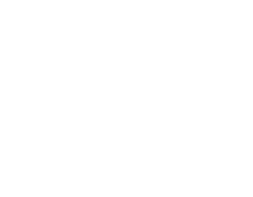
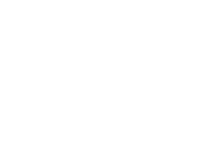
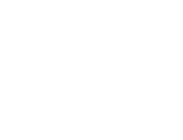
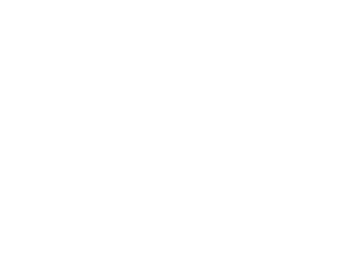

# ED Method (Error Diffusion Learning Algorithm) Explanation

**Error Diffusion Learning Algorithm - EDLA**

## Table of Contents
1. [What Is the ED Method?](#what-is-the-ed-method)
2. [Differences from the BP Method](#differences-from-the-bp-method)
3. [Theoretical Foundation of the ED Method](#theoretical-foundation-of-the-ed-method)
4. [ED Method Learning Algorithm](#ed-method-learning-algorithm)
5. [Experimental Results](#experimental-results)
6. [Features and Advantages](#features-and-advantages)
7. [References](#references)

---

## What Is the ED Method?

**The Error Diffusion Learning Algorithm (EDLA: ED Method)** is a supervised learning algorithm for hierarchical neural networks.

### Developer
- Original algorithm developed by **Isamu Kaneko**
- Published in 1999, paper submission in progress (at that time)

### Basic Concept
The ED method is a learning algorithm that more faithfully mimics the structure and function of actual brain neural systems. It addresses the biological unnaturalness of the conventional error backpropagation method (BP method) and proposes a more biologically plausible learning mechanism.

---

## Differences from the BP Method

### Problems with the BP Method (As Pointed Out by Kaneko)

> **"When considered as a simulation of actual neural systems, BP is far too strange"**

1. **Axonal Reverse Flow Problem**: The fact that error information is computed while flowing backward through axons is biologically unnatural
2. **Momentum Term Concept**: Lacks biological basis
3. **Complex Gradient Calculation**: Difficult to realize in actual neural systems

### The ED Method Approach

The ED method solves these problems based on the following biological facts:

1. **Information Diffusion via Chemical Substances**
   - Error information propagates through space as concentrations of aminergic neurotransmitters (noradrenaline, dopamine, serotonin, etc.)
   - Broadcast-type information transmission through varicosity structures

2. **Distinction between Excitatory and Inhibitory**
   - Introduction of excitatory/inhibitory distinction at the neural cell level
   - Consideration of cell-level distinction in addition to conventional synapse-level distinction

---

## Theoretical Foundation of the ED Method

### Basic Structure of Neural Circuits

The ED method considers the following biological features:

1. **Role of Aminergic Neural Systems**
   - Modeling of aminergic neural systems in addition to amino acid systems like glutamate and GABA
   - Incorporation of functions such as the A10 neural system (dopamine-driven)

2. **Column Structure**
   - Adjacent neural cell groups (columns) share information
   - Columns operate as one giant element
   - Teacher signals from the output layer are directly used in intermediate layers

3. **Role of Excitatory/Inhibitory Cells**
   - Excitatory neurons: All outputs act in an excitatory manner
   - Inhibitory neurons: All outputs act in an inhibitory manner
   - This distinction enables local determination of weight change direction

### Principle of Learning Direction Determination

The direction of weight changes is based on the following principles:

When wanting to increase output in the final layer, increasing connections between cells of the same type raises the final layer output, while increasing connections between different types of cells lowers the final layer output. Let us consider the direction of weight changes in the following figures:

#### Figures 1 & 2: Basic Weight Change Directions

  
*Figure 1: Weight change direction for increasing final layer output*

  
*Figure 2: Weight change direction for decreasing final layer output*

These figures show the distinction between excitatory (○) and inhibitory (●) neurons and the direction of weight changes between their connections. Figure 1 shows that strengthening connections between cells of the same type increases output, while Figure 2 shows that strengthening connections between different types of cells decreases output.

Although this differs from actual neural systems, if we consider connections between same types as excitatory and connections between different types as inhibitory, as shown in Figures 3 & 4 below, we can see that to increase output we should strengthen connections from excitatory cells, and to decrease output we should strengthen connections from inhibitory cells:

#### Figures 3 & 4: Implementation-Suitable Weight Change Method

  
*Figure 3: Output control by strengthening connections from excitatory cells*

  
*Figure 4: Output control by strengthening connections from inhibitory cells*

Figures 3 & 4 show a weight change method more suitable for implementation. In this method, consistent learning direction determination becomes possible: strengthening connections from excitatory cells when wanting to increase output, and strengthening connections from inhibitory cells when wanting to decrease output.

This principle enables consistent learning regardless of network shape. The method shown in Figures 3 & 4 is adopted so that it works without problems even in 3-layer structures (for up to 2 layers, Figures 1 & 2 and Figures 3 & 4 yield the same results).

---

## ED Method Network Structure

### Input Layer

The input layer of the ED method consists of excitatory and inhibitory neurons forming one pair, with each pair responsible for one input (pixel). The same value is fed into both the excitatory and inhibitory neurons in a pair.

### Output Layer

One excitatory neuron is responsible for each output.

## ED Method Learning Algorithm

### BP Method Basic Equations (For Comparison)

First, to understand the ED method, we show the basic equations of the conventional BP method.

#### Neural Element Output Computation

**Output computation formula:**
$$o_i^k = f(i_i^k) \quad \text{...(1)}$$

**Sum of inputs:**
$$i_j^k = \sum_{i} w_{ij}^k o_i^{k-1} \quad \text{...(2)}$$

**Sigmoid function:**
$$f(x) = \frac{1}{1+\exp(-2x/u_0)} \quad \text{...(3)}$$

#### Error Function

In the BP method, the squared error with respect to the teacher signal $y$ at the output layer is minimized:
$$r = \frac{1}{2}(y - o^m)^2$$

> **Note**: The error function formula above was presented as an image ("2.gif") in Isamu Kaneko's original material, and has been reconstructed here based on the standard squared error function for neural networks.

#### BP Method Weight Update

**Basic weight update formula:**
$$\Delta w_{ij}^k = -\varepsilon \frac{\partial r}{\partial w_{ij}^k} \quad \text{...(4)}$$

**Expansion of partial derivative:**
$$-\frac{\partial r}{\partial w_{ij}^k} = -\frac{\partial r}{\partial o_j^k} \frac{\partial o_j^k}{\partial i_j^k} \frac{\partial i_j^k}{\partial w_{ij}^k} \quad \text{...(5)}$$

$$= -\frac{\partial r}{\partial o_j^k} f'(o_j^k)o_i^{k-1} \quad \text{...(6)}$$

**Error term at the output layer:**
$$d^m = -\frac{\partial r}{\partial o^m} = y - o^m \quad \text{...(7)}$$

### ED Method Learning Rule

In the ED method, the above BP method concepts are modified into a biologically plausible form.

#### 1. Definition of Amine Concentration

From the error at the output layer, excitatory and inhibitory amine concentrations are defined:

**Error signal at the output layer (always excitatory):**
- When $y - o^m > 0$: $d^{m+} = y - o^m$, $d^{m-} = 0$
- When $y - o^m < 0$: $d^{m+} = 0$, $d^{m-} = o^m - y$

#### 2. Information Diffusion (Propagation of Amine Concentration)

Amine concentration diffuses to all layers through space:
- $d^{k+} = d^{m+}$ (same value across all layers)
- $d^{k-} = d^{m-}$ (same value across all layers)

#### 3. Weight Update Rule

**Connections from excitatory cells:**
$$\Delta w_{ij}^k = \varepsilon d_j^{k+} f'(o_j^k) o_i^{k-1} \text{sign}(w_{ij}^k)$$

**Connections from inhibitory cells:**
$$\Delta w_{ij}^k = \varepsilon d_j^{k-} f'(o_j^k) o_i^{k-1} \text{sign}(w_{ij}^k)$$

> **Note**: In the weight update formulas above, the original material had "sin(w_{ij}^k)" in the formula for inhibitory cells. This has been corrected to "sign(w_{ij}^k)" based on context. Variable notation has also been unified for consistency.

#### 4. Derivative of Sigmoid Function

As in the BP method, a sigmoid function is used:
$$f'(x) = f(x)(1 - f(x))$$

#### 5. Weight Constraints

**Between same-type cells (excitatory–excitatory, inhibitory–inhibitory):**
$$w_{ij}^k > 0$$

**Between different-type cells (excitatory–inhibitory):**
$$w_{ij}^k < 0$$

### Characteristics

Important characteristics of the ED method:

- **Learning always proceeds in the direction of increasing the absolute value of weights**
- **Uses sigmoid function as input/output function**
- **Conceptually close to a simple hill-climbing method like the perceptron**
- **Biologically plausible information propagation mechanism**

### Fundamental Differences between BP and ED Methods

**Problems with the BP method:**

- Error information flows backward through axons (biologically unnatural)
- Complex gradient calculations are required
- Parameter tuning is difficult

**Solutions provided by the ED method:**

- Spatial information diffusion via aminergic neurotransmitters
- Simple learning direction determination through the distinction between excitatory/inhibitory cells
- Weight updates possible using only local information

> **Note**: The "Fundamental Differences between BP and ED Methods" section above has been organized and summarized by the editor for clarity, based on the content of Isamu Kaneko's original material.

---

## Experimental Results

### XOR Problem (Requires Intermediate Layer)

| Intermediate Layer Units | ED Convergence Steps | MBP Convergence Steps |
|-------------|---------------|----------------|
| 32          | 8.26          | 117.17         |
| 64          | 5.97          | 93.84          |
| 128         | 5.09          | Does not converge |
| 256         | 4.62          | Does not converge |

**Result**: With a sufficient number of intermediate units, the ED method can learn XOR in 5 steps

### Parity Check Problem

**Characteristics of the ED method:**
- Convergence accelerates as the number of intermediate layer units increases
- No need to optimize the number of units for each problem
- Can learn 8-bit parity (256 patterns) in 300 steps

**Comparison with BP method:**
- BP method requires optimization of the number of intermediate layers for each problem
- Sensitive to parameters and difficult to tune
- Frequently fails to converge on complex problems

### Handwritten Character Recognition

**Experimental conditions:**
- 16×16 binary images (256-bit input)
- 10 types of handwritten digits (10-bit output)
- Recognition rate measured on 1000 separate characters after training on 1000 characters

| Intermediate Layer Units | ED Recognition Rate | ED Convergence Steps | MBP Recognition Rate | MBP Convergence Steps |
|-------------|----------|----------------|-----------|----------------|
| 128         | 91.89%   | 9.2           | 95.38%    | 107.5          |
| 256         | 92.45%   | 9.2           | Does not converge | -         |
| 512         | 93.14%   | 9.3           | Does not converge | -         |

**Results:**
- The ED method has extremely fast convergence (9 steps)
- Recognition rate improves as the number of intermediate layer units increases
- BP method has superior generalization capability but has convergence difficulties

---

## Features and Advantages

### Key Features of the ED Method

1. **Biological Plausibility**
   - Mechanisms realizable in actual neural systems
   - Information diffusion via aminergic neurotransmitters
   - Distinction between excitatory and inhibitory cells

2. **Simple Algorithm**
   - Simpler and easier to understand than BP method
   - Easy parameter tuning
   - Stable operation

3. **Excellent Convergence**
   - Faster convergence with more intermediate layer units
   - Particularly excellent at logical circuit learning
   - Robust to parameter variations

4. **Scalability**
   - No limit on the number of intermediate layers
   - Can handle complex problems
   - Suitable for hardware implementation

### Application Domains

**Strengths:**
- Logical circuit learning
- Pattern classification
- Behavioral learning through reinforcement learning

**Expected applications:**
- Action planning in the prefrontal cortex
- Reinforcement learning in conjunction with reward systems
- Applications in computational behavioral science

---

## Summary

The ED method is an innovative algorithm conceived as a learning rule for actual neural systems. It resolves the biological unnaturalness of the BP method and realizes simpler, more efficient learning.

### Key Contributions

1. **Proposal of a biologically plausible learning algorithm**
2. **Modeling functions of the aminergic neural system**
3. **A learning rule that considers excitatory/inhibitory effects**
4. **Achieving excellent convergence and stability**

The ED method is an important approach that bridges artificial intelligence and computational neuroscience, and further development is expected in the future.

> **Important note**: Regarding the distinction between Isamu Kaneko's original information and edited/supplemented portions in this explanation:
> 
> - **Original information**: Direct quotations and experimental results from Isamu Kaneko's 1999 website
> - **Edited/supplemented portions**: Some formula corrections, structural reorganization, and supplementary explanations are by the editor
> - **Inference-based reconstruction**: Reconstruction of formulas that were displayed as images in the original is based on standard neural network theory
> 
> All original research achievements and theories are by Isamu Kaneko.

---

## References

1. Isamu Kaneko, "Error Diffusion Learning Algorithm Sample Program", 1999
   - URL: https://web.archive.org/web/19991124023203/http://village.infoweb.ne.jp:80/~fwhz9346/ed.htm
2. Isamu Kaneko, "Paper on Error Diffusion Learning Algorithm", 1999 (in submission)
3. Hiroaki Kitano (ed.), "Genetic Algorithms (2)", Chapter 7 (on aminergic neural systems)

## Image and Figure Sources and Copyright

### Copyright Information for Figures 1–4

Figures 1–4 (fig1.gif–fig4.gif) included in this document are quoted from Isamu Kaneko's 1999 original material:

- **Source**: Isamu Kaneko's website "Error Diffusion Learning Algorithm Sample Program" (1999)
- **Archive URL**: https://web.archive.org/web/19991124023203/http://village.infoweb.ne.jp:80/~fwhz9346/ed.htm
- **Copyright**: Isamu Kaneko
- **Usage purpose**: Quotation for academic explanation and educational purposes

### Description of Figures

- **Figure 1**: Weight change direction for increasing final layer output (basic concept of excitatory/inhibitory)
- **Figure 2**: Weight change direction for decreasing final layer output (basic concept of excitatory/inhibitory)
- **Figure 3**: Output control by strengthening connections from excitatory cells (implementation-oriented method)
- **Figure 4**: Output control by strengthening connections from inhibitory cells (implementation-oriented method)

These figures are valuable materials that visually explain the core mechanism of the ED method: "learning direction determination through the distinction between excitatory and inhibitory cells."

---

**Note**: This explanation is based on Isamu Kaneko's original material (1999). The ED method is Kaneko's original approach, and the theory and experimental results presented here are his research achievements.

**Disclaimer regarding editing and supplementation**:
- Formulas that were displayed as images in the original material have been reconstructed based on standard neural network theory
- Some notation unification and structural reorganization was done by the editor
- For interpretation of the original research content and experimental results, please refer to the original material

**Date created**: June 28, 2025  
**Based on**: Isamu Kaneko's website (1999, Web Archive version)  
**Editor's note**: Includes formula reconstruction and structural reorganization
