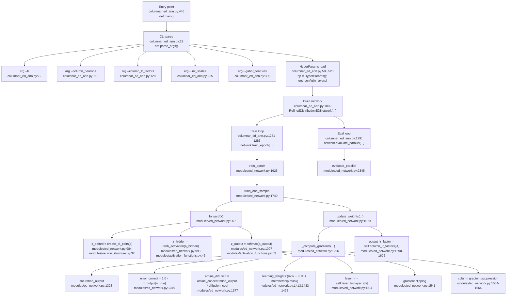
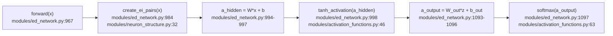
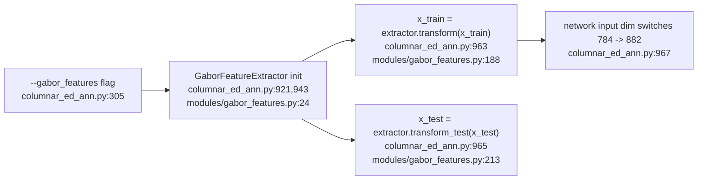
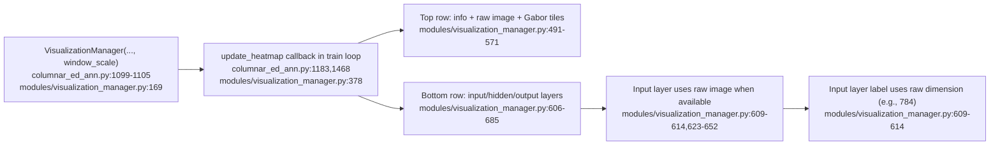
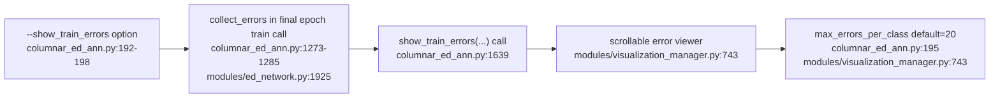

# ED Learning Mechanism (Mermaid, 1:1 Code Anchors)

This document maps implementation paths to exact symbol names and file/line anchors in:
- `columnar_ed_ann.py` (published/remote main implementation)
- `modules/ed_network.py`
- `modules/column_structure.py`
- `modules/neuron_structure.py`
- `modules/activation_functions.py`
- `modules/gabor_features.py`
- `modules/visualization_manager.py`

Note:
- Line anchors for `columnar_ed_ann.py` are based on the current published/remote repository version.
- If `columnar_ed_ann.py` changes later, anchors should be re-synced to the final confirmed version.

## 1. End-to-end execution path

## 2. Feature section: Forward and activation flow

## 3. Feature section: ED gradient core (no backprop chain rule)

```mermaid
flowchart LR
    A["_compute_gradients(...)<br/>modules/ed_network.py:1296"] --> B["saturation_output = abs(z)*(1-abs(z))<br/>modules/ed_network.py:1328"]
    A --> C["error_correct = 1 - z_output[y_true]<br/>modules/ed_network.py:1349"]
    C --> D["amine concentration setup<br/>modules/ed_network.py:1356-1369"]
    D --> E["amine_diffused = amine * u_coef<br/>modules/ed_network.py:1377"]
    E --> F["rank of active neurons<br/>modules/ed_network.py:1393-1410"]
    F --> G["LUT learning_weights<br/>modules/ed_network.py:1413"]
    G --> H["membership/NC masks via np.where<br/>modules/ed_network.py:1433-1478"]
    H --> I["learning_signals_3d<br/>modules/ed_network.py:1486-1490"]
    I --> J["delta_w layer update matrix<br/>modules/ed_network.py:1497-1506"]
    J --> K["layer_lr scale<br/>modules/ed_network.py:1511"]
    K --> L["gradient clip<br/>modules/ed_network.py:1541-1546"]
    L --> M["column_lr_factors suppression<br/>modules/ed_network.py:1554-1564"]
```

## 4. Feature section: Column structure and class-specific suppression

```mermaid
flowchart LR
    A["create_column_membership(...)<br/>modules/column_structure.py:44"] --> B["membership bool map [class, neuron]<br/>modules/column_structure.py:73-142"]
    B --> C["network stores membership per layer<br/>modules/ed_network.py:380,421,429"]
    C --> D["active_membership for active classes<br/>modules/ed_network.py:1401-1405"]
    D --> E["rank/LUT masked by membership<br/>modules/ed_network.py:1433-1478"]
    E --> F["column_lr_factors suppress gradients<br/>modules/ed_network.py:1554-1564"]
    F --> G["output side factor suppression<br/>modules/ed_network.py:1590-1602"]
```

## 5. Feature section: Gabor preprocessing path

## 6. Feature section: Visualization and heatmap window

## 7. Feature section: Misclassified training samples viewer

