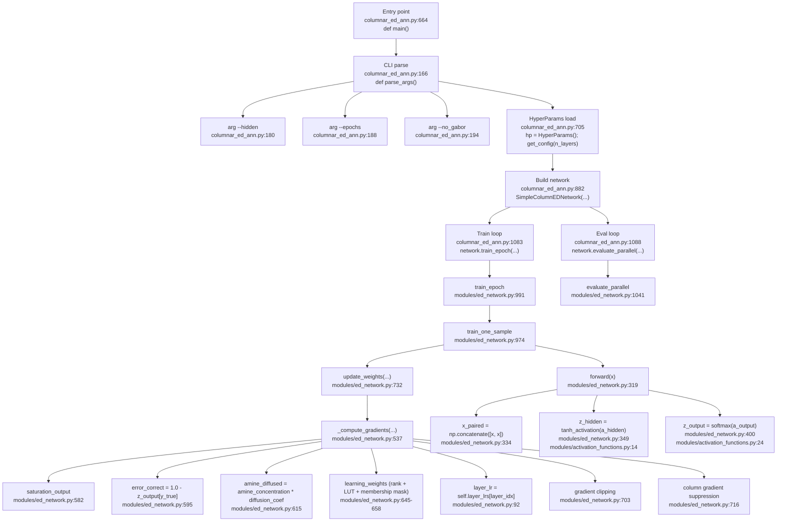
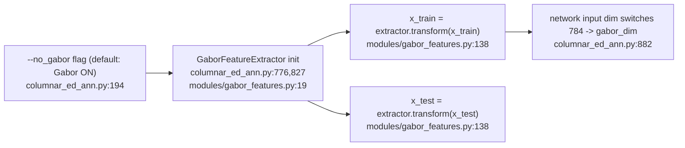
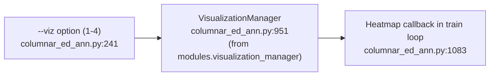

# ED学習メカニズム（Mermaid, 1:1コードアンカー）

このドキュメントは、実装パスを実際のシンボル名とファイル/行番号アンカーに対応付けたものです。
対象ファイル:
- `columnar_ed_ann.py`（公開版）
- `modules/ed_network.py`
- `modules/column_structure.py`
- `modules/activation_functions.py`
- `modules/gabor_features.py`

注記:
- 行番号アンカーは、現在の公開版実装（v1.2.0）を基準にしています。
- コード更新により行番号が変動する可能性があります。

## 1. End-to-end実行パス

## 2. 機能別セクション: 順伝播と活性化フロー

## 3. 機能別セクション: ED勾配コア（連鎖律ベース逆伝播なし）

## 4. 機能別セクション: コラム構造とクラス特異的抑制

## 5. 機能別セクション: Gabor前処理パス

## 6. 機能別セクション: 可視化

