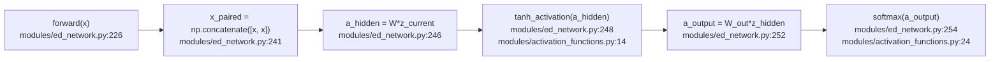
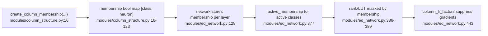
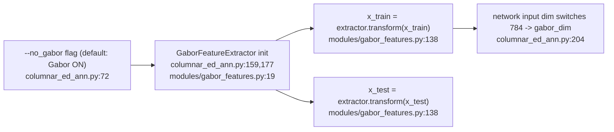
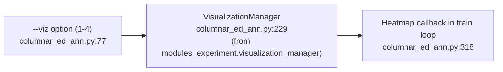

# ED学習メカニズム（Mermaid, 1:1コードアンカー）— メイン版

このドキュメントは、実装パスを実際のシンボル名とファイル/行番号アンカーに対応付けたものです。
対象ファイル:
- `columnar_ed_ann.py`（メイン版）
- `modules/ed_network.py`
- `modules/column_structure.py`
- `modules/activation_functions.py`
- `modules/gabor_features.py`

> **注記**: 実験版（`columnar_ed_ann_experiment.py` + `modules_experiment/`）のアンカーは、[ed_learning_mechanism_anchors_experiment.md](ed_learning_mechanism_anchors_experiment.md) を参照してください。

注記:
- 行番号アンカーは、現在のメイン版実装を基準にしています。
- コード更新により行番号が変動する可能性があります。

## 1. End-to-end実行パス

## 2. 機能別セクション: 順伝播と活性化フロー

## 3. 機能別セクション: ED勾配コア（連鎖律ベース逆伝播なし）

```mermaid
flowchart LR
    A["_compute_gradients(...)<br/>modules/ed_network.py:289"] --> B["saturation_output = abs(z)*(1-abs(z))<br/>modules/ed_network.py:334"]
    A --> C["error_correct = 1 - z_output[y_true]<br/>modules/ed_network.py:347"]
    C --> D["amine concentration setup<br/>modules/ed_network.py:346-349"]
    D --> E["amine_diffused = amine * diffusion_coef<br/>modules/ed_network.py:363"]
    E --> F["rank of active neurons<br/>modules/ed_network.py:377-386"]
    F --> G["LUT learning_weights<br/>modules/ed_network.py:386"]
    G --> H["membership mask via np.where<br/>modules/ed_network.py:389"]
    H --> I["learning_signals_3d<br/>modules/ed_network.py:414"]
    I --> J["delta_w layer update matrix<br/>modules/ed_network.py:424"]
    J --> K["gradient clip<br/>modules/ed_network.py:433-439"]
    K --> L["column_lr_factors suppression<br/>modules/ed_network.py:443"]
```

## 4. 機能別セクション: コラム構造とクラス特異的抑制

## 5. 機能別セクション: Gabor前処理パス

## 6. 機能別セクション: 可視化

注記: メイン版の可視化は `modules_experiment/visualization_manager.py` を利用します。
`--show_train_errors` 機能は実験版のみで利用可能です。
