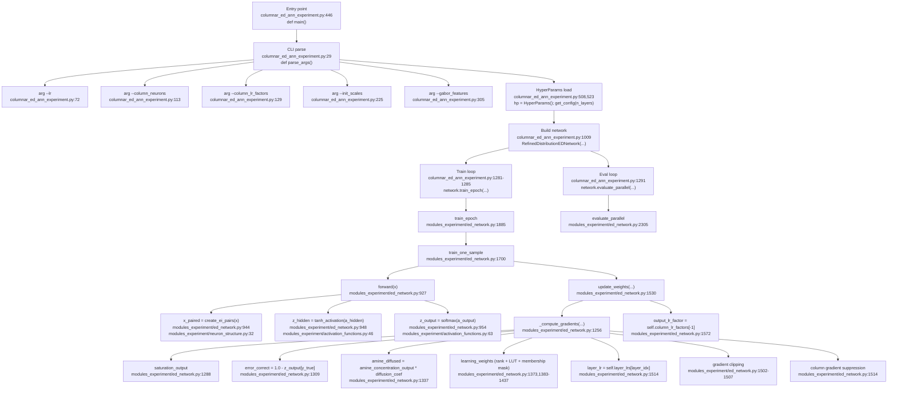
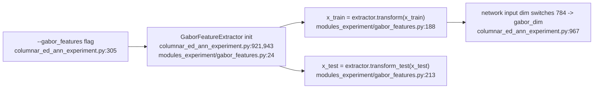
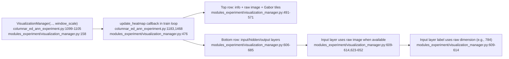
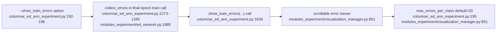

# ED学習メカニズム（Mermaid, 1:1コードアンカー）— 実験版

このドキュメントは、実装パスを実際のシンボル名とファイル/行番号アンカーに対応付けたものです。
対象ファイル:
- `columnar_ed_ann_experiment.py`（実験版）
- `modules_experiment/ed_network.py`
- `modules_experiment/column_structure.py`
- `modules_experiment/neuron_structure.py`
- `modules_experiment/activation_functions.py`
- `modules_experiment/gabor_features.py`
- `modules_experiment/visualization_manager.py`

> **注記**: メイン版（`columnar_ed_ann.py` + `modules/`）のアンカーは、[ed_learning_mechanism_anchors.md](ed_learning_mechanism_anchors.md) を参照してください。

注記:
- 行番号アンカーは、現在の実験版実装を基準にしています。
- コード更新により行番号が変動する可能性があります。

## 1. End-to-end実行パス

## 2. 機能別セクション: 順伝播と活性化フロー

```mermaid
flowchart LR
    A["forward(x)<br/>modules_experiment/ed_network.py:927"] --> B["create_ei_pairs(x)<br/>modules_experiment/ed_network.py:944<br/>modules_experiment/neuron_structure.py:32"]
    B --> C["a_hidden = W*x + b<br/>modules_experiment/ed_network.py:946-947"]
    C --> D["tanh_activation(a_hidden)<br/>modules_experiment/ed_network.py:948<br/>modules_experiment/activation_functions.py:46"]
    D --> E["a_output = W_out*z + b_out<br/>modules_experiment/ed_network.py:952-953"]
    E --> F["softmax(a_output)<br/>modules_experiment/ed_network.py:954<br/>modules_experiment/activation_functions.py:63"]
```

## 3. 機能別セクション: ED勾配コア（連鎖律ベース逆伝播なし）

```mermaid
flowchart LR
    A["_compute_gradients(...)<br/>modules_experiment/ed_network.py:1256"] --> B["saturation_output = abs(z)*(1-abs(z))<br/>modules_experiment/ed_network.py:1288"]
    A --> C["error_correct = 1 - z_output[y_true]<br/>modules_experiment/ed_network.py:1309"]
    C --> D["amine concentration setup<br/>modules_experiment/ed_network.py:1305-1311"]
    D --> E["amine_diffused = amine * diffusion_coef<br/>modules_experiment/ed_network.py:1337"]
    E --> F["rank of active neurons<br/>modules_experiment/ed_network.py:1348-1373"]
    F --> G["LUT learning_weights<br/>modules_experiment/ed_network.py:1373"]
    G --> H["membership/NC masks via np.where<br/>modules_experiment/ed_network.py:1383-1437"]
    H --> I["learning_signals_3d<br/>modules_experiment/ed_network.py:1464-1467"]
    I --> J["delta_w layer update matrix<br/>modules_experiment/ed_network.py:1492-1493"]
    J --> K["gradient clip<br/>modules_experiment/ed_network.py:1502-1507"]
    K --> L["column_lr_factors suppression<br/>modules_experiment/ed_network.py:1514"]
```

## 4. 機能別セクション: コラム構造とクラス特異的抑制

```mermaid
flowchart LR
    A["create_column_membership(...)<br/>modules_experiment/column_structure.py:44"] --> B["membership bool map [class, neuron]<br/>modules_experiment/column_structure.py:73-142"]
    B --> C["network stores membership per layer<br/>modules_experiment/ed_network.py:63"]
    C --> D["active_membership for active classes<br/>modules_experiment/ed_network.py:1362"]
    D --> E["rank/LUT masked by membership<br/>modules_experiment/ed_network.py:1383-1437"]
    E --> F["column_lr_factors suppress gradients<br/>modules_experiment/ed_network.py:1514"]
    F --> G["output side factor suppression<br/>modules_experiment/ed_network.py:1572"]
```

## 5. 機能別セクション: Gabor前処理パス

## 6. 機能別セクション: 可視化とヒートマップウィンドウ

## 7. 機能別セクション: 不正解学習サンプルビューア

